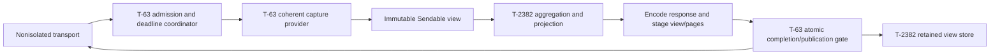

# Portfolio summaries: design

## Overview

Add `query_project_summaries` and a snapshot-bound mode of `query_tasks`. Both operate on a retained immutable capture supplied by T-63; the summary service aggregates it without fetching live models.

## Architecture and ownership

| Owner | Files / responsibility | Integration contract |
| --- | --- | --- |
| T-63 | `MCPServer.swift`, server lifecycle extensions, `MCPToolHandler.swift`, `MCPToolDefinitions.swift`, `MCPTypes.swift` | Sole writer of routing, common dependency initialization, dispatch, read-only classification, shared schema wiring and `_meta` envelope. Register new summary tool and route `query_tasks` with `snapshotId` to the T-2382 helper. |
| T-63 | Shared read coordinator, capture/freshness DTOs and provider | Admit before executor queueing; preserve five-second encoded-response availability and eight unfinished physical reads, including timed-out workers. Provide a coherent, save-free, value-only capture and a publication permit. |
| T-2382 | `MCPToolHandler+PortfolioSummary.swift`, `MCPToolHandler+SnapshotTaskQuery.swift`, `MCPPortfolioToolDefinitions.swift` | Supply registry descriptor, strict request parsers and reusable-view handlers; ordinary queries remain on the existing path. |
| T-2382 | `MCPReusableSnapshotStore.swift`, `MCPPortfolioSummaryRequest.swift`, `MCPSnapshotTaskQueryRequest.swift`, `MCPPortfolioProjection.swift`, `Services/PortfolioSummaryService.swift` | Retain views/pages, aggregate counts, and project captured task detail. No transport timer, CloudKit trigger, model mutation, receipt or guard implementation. |

T-63 integrates the small registration patch after the isolated T-2382 modules exist. The workers exchange interface sketches and a deterministic capture fixture before production edits. Implementation uses an integration revision containing the approved T-2380 read contract; no work is copied into or changed on T-2380's branch. No migration or CloudKit schema deployment is part of this feature.



### Pattern extension audit

| Existing site | Equivalent needed? | Plan |
| --- | --- | --- |
| `MCPToolDefinitions.tools` and handler `readOnlyToolNames` | Yes | T-63 registers summary descriptor as covered read, including fallback-storage classification. |
| `MCPToolHandler.init`, `handleToolCall` | Yes | T-63 injects summary/store dependencies and dispatches new tool and snapshot mode. |
| `MCPTaskQueryRequest.parse` / `handleQueryTasks` | Yes | T-63 dispatches snapshot mode before ordinary parser; no snapshot argument is silently ignored. Preserve ordinary stored-status filters. |
| `encodeQueryPages` / `MCPTaskQuerySnapshotStore` | Yes | Reusable pages belong to the new store, share the view's expiry, and retain outer metadata. Ordinary cursor pages retain their existing store/limits. |
| `setTaskQueryAdmission`, server start/stop/unexpected teardown | Yes | T-63 closes new-view admission and advances store lifecycle generation; clear reusable views and pages as well as ordinary pages. |
| T-2380 `MCPRecordSnapshot.task` / canonical revision helpers | Yes | Capture full comment-covered revision before stripping comment bodies; retain token across all snapshot queries and continuations. Do not remint from derived status fields. |
| `get_projects.activeTaskCount`, `ProjectService.activeTaskCount` | No change | Keep legacy nonterminal semantics. Explain it in schema/caller docs. |
| App Intents, `ReportLogic`, report UI | No | Requirements exclude these surfaces; do not add summary integration there. |

## Components and interfaces

The names below are interface sketches to agree with T-63 at design approval; their behavior and ownership are the integration contract.

```swift
// nonisolated Sendable value types supplied by T-63
struct CapturedReadView: Sendable {
    let metadata: ReadCaptureMetadata
    let captureScope: ReadCaptureScope // wholePortfolio, projects([LocalRecordKey]), or selectedQuery for ordinary narrow reads
    let createdAt: ContinuousClock.Instant
    let retentionDeadline: ContinuousClock.Instant
    let projects: [ReadProject]
    let tasks: [ReadTask]
    let milestones: [ReadMilestone]
    let comments: [ReadCommentEvidence]
}

// T-2382: pure value computation; no ModelContext or await
PortfolioSummaryService.summarize(view: CapturedReadView,
                                 window: CompletionWindow) throws -> PortfolioSummary
MCPPortfolioProjection.task(record: ReadTask,
                            detail: SnapshotTaskDetail) throws -> EncodedTaskRecord

// T-2382: synchronized retention, never actor-dependent for deadline arbitration
MCPReusableSnapshotStore.reserveCreate(viewBytes: Int) throws -> RetentionReservation
MCPReusableSnapshotStore.reserveAppend(root: RetainedView,
                                      pageBytes: Int) throws -> RetentionReservation
MCPReusableSnapshotStore.prepare(reservation: RetentionReservation,
                                bundle: EncodedViewBundle) throws -> StagedPublication
MCPReusableSnapshotStore.lookup(snapshotId: String) throws -> RetainedView
MCPReusableSnapshotStore.rollback(reservation: RetentionReservation)
// Common T-63 source: returns the existing shared capture, never recaptures
MCPRetainedViewSource.view(for snapshotID: String,
                         now: ContinuousClock.Instant) throws -> CapturedReadView
// T-63 enclosing response permit commits all staged entries + chooses response
// Common T-63 prepared result + injected single synchronization domain
PreparedReadResult(encodedResponseData: Data,
                   publications: [MCPPreparedPublication])
MCPPreparedPublication.validateLocked(domain: MCPReadPublicationDomain) -> PublicationRejection?
MCPPreparedPublication.commitLocked() // nonthrowing, after all validations
MCPPreparedPublication.discardLocked()
// Parent coordinator selects bytes and all publications under one domain lock
MCPReadPublicationDomain.complete(results: [PreparedReadResult],
                                  rejectionBytes: PreencodedPublicationErrors)
```

The shared types above use T-63's `CapturedReadView`, `ReadCaptureMetadata`, `ReadProject`, `ReadTask`, `ReadMilestone` and `ReadCommentEvidence`. The view includes `CaptureCompleteness.selectedRead` or `.completePortfolio`; `.completePortfolio` means complete resolved portfolio or project scope, including every selected task and all identity, relationship and comment closure needed to validate attribution and canonical revisions; it does not require unrelated task bodies for a scoped project. A portfolio/reusable capture requires that completeness, canonical r1/full task JSON and every required comment-evidence record. Inadequate completeness returns `incoherent_capture`, not a partial summary. T-2382's retained wrapper adds resolved scope, original completion window, initial summary options and page bundles; it does not define another capture DTO. The provider accepts a portfolio/project selection and resolves that selection inside its fence. Shared `ReadCaptureScope` explicitly records `.wholePortfolio`, `.projects([LocalRecordKey])`, or `.selectedQuery` for an ordinary narrow read on the captured view; completeness applies only to that declared scope. The retained wrapper preserves the same typed scope value; reusable summary views accept wholePortfolio/projects, never selectedQuery. A scoped view never claims whole-portfolio evidence, and reusable queries outside its captured physical project keys return `SNAPSHOT_INCOMPATIBLE`, even when identity closure includes other endpoint records. No scoped request expands to all unrelated task bodies. These exact shared field/type/case names are confirmed by T-63 through the parent’s single-writer coordination. The supplied new-tool descriptor names `query_project_summaries`, marks it covered/read-only, uses the shared `readPolicy` schema, and declares the initial/replay/continuation argument branches in the wire table.

Captured records carry canonical encoded SwiftData `PersistentIdentifier` physical keys (`LocalRecordKey`) as well as stored UUIDs; relationships carry the actual referenced physical keys and stored referenced UUIDs. Use those keys to count physical records, resolve relationships to the captured endpoint, and detect duplicate-UUID ambiguity. Public diagnostic samples expose stored identity and a capture-local discriminator only when needed; they do not grant a new persistent identity. `ReadCommentEvidence` contains comment ID, physical key, parent task physical key, stored task UUID and creation date.

Captured task values include raw/effective status, dates, project/milestone references, full task fields, metadata and the T-2380 revision token. Comment activity uses comment UUID/time/task reference. The provider reads all comment-covered values needed for revision generation, then retains comment evidence and comment-stripped task detail; `includeComments:false` does not mean an incomplete revision. No `@Model`, `ModelContext`, or `[String: Any]` crosses the actor boundary: convert to typed Sendable values or encoded `Data` inside capture.

T-63's capture provider is the coherence authority. Read committed local store state in a fresh autosave-disabled context; do not save/rollback the UI context or include uncommitted edit-form changes. Bracket a nonawaiting value copy with newest SwiftData history token, store identity and import-monitor epoch, using separate fresh validation contexts for history. A changed, expired, missing or unusable fence returns `incoherent_capture`; it cannot publish a mixed view. An empty persisted store uses a validated empty-history sentinel; CloudKit-free in-memory test fixtures use T-63's injected nonawaiting actor-only fence with no external writers. Fetch the newest transaction with `HistoryDescriptor.fetchLimit = 1`, descending transaction identifier. Copy relationship physical keys, raw UUIDs and all required evidence before returning; aggregation never fetches or repairs live relationships. If CoreData import-event store identity cannot be proven to correspond to SwiftData history store identity, freshness is `unknown`, not recent evidence. Reuse T-63's fence/provider rather than building another one. See Decision 2.

## Wire contract

All successful pages/replays include the identical T-63 outer metadata at `_meta["me.nore.ig.transit/read"] = {asOf, snapshotId, freshness, read}`. `asOf` is completed local capture time with UTC millisecond precision. Freshness assessment, import evidence, policy/outcome and capture identity belong to that view; no reuse waits for a new import. Failure without a capture does not invent these fields.

| Call | Accepted arguments | Behavior |
| --- | --- | --- |
| New `query_project_summaries` | Required `start`, `end`, `limit` (1–100); optional exclusive `projectId` or `project`; optional T-63 `readPolicy` | No selector means portfolio. Validate scalar arguments before capture; resolve UUID or `ProjectNamePolicy.normalized` name inside the fenced project copy and capture selected tasks/identity closure under that same fence. Reject both selectors, unknown/ambiguous identity, wrong types and unknown fields. Default refresh-if-needed. |
| Summary replay | `snapshotId` only | Return the original first page, original window and metadata. No scope, window, limit, or policy overrides. |
| Summary continuation | `cursor`, optional same T-63 `readPolicy` | Return original page; no selectors or new options. Policy validation/lookup precedence matches T-63 cursor contract. |
| Snapshot-bound `query_tasks` | Required `snapshotId`, `detailLevel` (`summary`/`full`), `includeComments:false`, `limit` (1–100); optional `projectId`, `status` array | Use captured UUID scope and effective statuses. Other selectors/filters, comment bodies, scope expansion and policy overrides return typed compatibility errors. |
| Task continuation | `cursor`, optional same T-63 `readPolicy` | Reusable cursors use UUID-formatted version-8 tokens; ordinary UUID-generation cursors use version 4. Route by version even after expiry, and reject unknown/expired tokens without fresh capture. Publication checks collisions against published and reserved tokens atomically. |

Task rows sort by task UUID then capture-local record key. Summary rows sort by normalized project name, project UUID and physical key; milestones sort by UUID/physical key. No locale-dependent ordering. All filters, including empty status-array semantics (no status restriction), are documented. Valid requested status strings must be one of the eight statuses; duplicate entries are deduplicated. Snapshot scope can narrow a portfolio capture to a project but cannot expand a project capture. A project that exists only in current live data is not added to a retained view.

The summary text payload is `{projects, unresolvedProjects, diagnostics, completionWindow, nextCursor, expiresAt}`. `projects` entries contain `projectId`, `name`, `countsByStatus`, `totalTaskCount`, `ideaCount`, `inProgressCount`, `workflowTaskCount`, `nonterminalTaskCount`, `recentCompletions`, `lastRecordedActivity`, `milestones`, `unassignedMilestone`, `invalidMilestoneAssociations`, and scoped diagnostics. Every bucket includes zero statuses. `recentCompletions` contains `done`, `abandoned`, and `missingCompletionDateCount`; unknown project records appear only in the portfolio's separate breakdown.

Milestone rows expose `milestoneId`, nullable `displayId`, `name`, `rawStatus`, effective `status`, `invalidStatus`, status buckets, totals and recent completions. Snapshot full task rows preserve captured descriptions/metadata and canonical revision; `status` is effective, with `storedStatus` when raw status differs. Revisions cover stored content and comments, not derived display fields. Summary task detail has the ordinary summary fields, using captured values and the documented effective-status rule.

Window parsing accepts calendar-date ISO 8601 timestamps with seconds, an explicit `Z` or `±HH:mm` offset and zero to three fractional digits; reject date-only/local timestamps, invalid calendar components, unsupported precision/leap seconds and `start >= end`. Normalize output to UTC milliseconds and require canonical round-trip to preserve the parsed instant. Current done/abandoned membership and `start <= completionDate < end` determine window counts; missing dates contribute only to missing-date diagnostics.

## Aggregation and integrity

Build captured indexes by physical record key and UUID. If duplicate UUIDs make attribution or task filtering ambiguous for the requested scope, fail with `IDENTITY_AMBIGUITY`; unrelated duplicate UUIDs do not fail a scoped view. Never collapse task records by display ID, project name, or UUID. Scope closure includes relationship endpoints needed to detect ambiguity into the requested project.

Seed every captured project and milestone with eight zero status buckets. Traverse each included task once: increment project buckets, then exactly one of a valid same-project milestone, no milestone, or invalid milestone association. Portfolio orphans contribute to `unresolvedProjects` instead of a named project. Effective task status falls back to idea; invalid raw values receive separate exact diagnostic counts. Effective milestone status falls back to open with raw value retained. Compute derived counts from final buckets, not independent filters.

Activity candidates are task creation/status change, comment creation, milestone creation/status change. Select greatest timestamp; ties use lexical `(evidenceKind, evidenceUUID, physicalRecordKey)` ascending. Evidence kinds are stable strings (`task_creation`, `task_status`, `comment_creation`, `milestone_creation`, `milestone_status`). Empty projects have null activity. Milestone-only activity belongs to its captured project; orphan comments do not invent project activity.

Name/display-ID collision diagnostics count exact affected records. Sort identity samples lexically by entity kind, stored UUID, display ID and physical key, retain at most ten per category, and emit `sampleComplete = sampledCount == affectedCount`. Detect collisions in the captured identity closure; scope filters do not make an ambiguous referenced identity appear unique. Diagnostic collection cannot change aggregate totals.

## Retention, response deadlines and lifecycle

Keep at most eight reusable views and 16 MiB of charged encoded capture/summary/query-page bytes in the new store, separately from the existing eight/16 MiB ordinary-page store. Creation reserves one root slot and capture/page bytes; append reserves only additional page bytes against an existing pinned root. Published bytes plus all pending reservations share the limit. Concurrent projections cannot each spend the same remaining budget. Roll back reservations on timeout, failed encoding, stale store version, expired root or lifecycle invalidation; never evict a live view to make space. Purge expired entries using `ContinuousClock`; expiry is five minutes from completed capture creation, never extended by lookup, replay or new task-page generation. Logical encoded charges are not a total heap limit.

Lookup pins a retained view during bounded projection. The pin permits computation but not publication past its expiry or after lifecycle generation changes. New task pages carry that view's metadata and deadline; their root view, pages and charges are removed together. Cursor replay returns retained encoded payload and captured metadata. Server restart/stop/unexpected teardown invalidates reusable views/cursors; in-flight publication checks the same lifecycle generation. Timed-out physical workers retain T-63 admission across listener restart until they finish.

The T-63 coordinator owns deadline arbitration outside MainActor and independently admits at most eight unfinished physical operations. Timed-out workers remain charged until they really finish; do not release slots on cancellation/timeout alone. It pre-encodes request-specific timeout responses before dispatch and includes final enclosing-response encoding in the shared five-second deadline. Use T-63's strict independent timer at 4,850 ms and reserve the remaining 150 ms for compact final response completion; a timer scheduled exactly at five seconds has no remaining delivery margin. Verify that reserve under actual transport load before depending on it. Application-level mutate_tasks delivery never cancels or rewrites T-2380 write receipts; the read-only deadline does not apply to a mutating call.

Aggregation/encoding runs on detached value-only work. Check deadline/publication cancellation between record chunks; cancellation limits waste but is not the deadline guarantee. Stage immutable view/page/index bundles without exposing IDs. Outside the completion lock, coalesce all selected create/append publications for each store into one aggregate immutable index candidate, one expected store version and one capacity reservation covering their combined net charge. An internal aggregate may publish one candidate per affected store; independent whole-index candidates against the same store version are forbidden because successive swaps would lose earlier changes. T-63's `MCPReadPublicationDomain` supplies the single lock injected into ordinary and reusable stores; no store introduces an independent nested commit lock. Under that domain, validate deadline, lifecycle, root expiry, reservation ownership, cursor uniqueness and store version for every aggregate store candidate before committing any; perform exactly one index/budget swap per affected store and choose the response together. Prepared `commitLocked` is nonthrowing; `discardLocked` releases reservation ownership exactly once. A stale candidate selects preencoded `READ_BUSY` and rolls back rather than overwriting concurrent publication. Any commit-time rejection discards success bytes and selects matching preencoded error bytes: success cannot contain a snapshot/cursor ID whose publication failed. Preencode these rejection variants and their internal aggregate fallbacks before entering the gate. Retain displaced, expired or discarded large view/page/index bundles in a retirement result while under the gate and release their last references only after unlocking, including rejection, timeout and lifecycle paths. Gate bookkeeping is bounded; no encoding, capture, history scan, bulk-index construction or bulk ARC destruction occurs inside this completion critical section.

For an individual read submitted as one JSON-RPC object per POST, the enclosing T-63 permit owns the complete encoded response and staged publications. Publication succeeds only when final response encoding, validation and deadline arbitration all succeed; otherwise select preencoded typed failure bytes without unpublished IDs. Production JSON-RPC arrays are rejected under the user-approved latest-only transport contract. Application-level `mutate_tasks` remains one `tools/call`; preserve write receipts and do not apply the read-only deadline to a mutating call. Late workers cannot publish a snapshot, cursor or second response. Do not use a task group whose scope exit waits for a blocking fetch to finish.

Generic component aggregation remains an internal coordinator capability and test boundary, not production wire batching. Internal selected child reads retain private encoded results and staged publications under one aggregate permit; children cannot commit independently. Prepare one candidate per affected store, validate every selected candidate before any commit, and commit only publications selected in the final encoded aggregate. Preserve tests for two same-store changes, multi-store validation rejection, ready and blocked children, slow aggregate encoding and internal-cutoff timeout entries. On encoding, validation or deadline failure, roll back every selected staged publication and select preencoded failure bytes without unpublished IDs. Retire displaced/discarded large bundles outside the sole publication-domain lock.

## Errors

| Category | Code / caller action |
| --- | --- |
| Invalid selectors/window/types | `INVALID_INPUT`; correct request, no capture or view publication. |
| Missing/ambiguous project | `PROJECT_NOT_FOUND` / `AMBIGUOUS_PROJECT`; resolve identity. |
| Duplicate UUID attribution | `IDENTITY_AMBIGUITY`; repair upstream data outside this read. |
| Unsupported snapshot options/scope | `SNAPSHOT_INCOMPATIBLE`; use documented captured scope/options or start a new view. |
| Unknown/expired view or new-store cursor | `INVALID_SNAPSHOT` / `INVALID_CURSOR`; start a new summary; never recapture implicitly. |
| Retention capacity | `QUERY_CAPACITY_EXCEEDED`; narrow scope or retry after expiry. |
| Deadline/admission/retention contention | T-63 `READ_TIMEOUT` / `READ_BUSY`; back off, physical slot is retained until worker completion; stale prepared retention state rolls back. |
| Required fetch/coherence/encoding | T-63 `storage_failure` / `incoherent_capture` / `serialization_failure` categories; no complete-success fallback. |

## Testing and requirement traceability

| Requirements | Verification |
| --- | --- |
| 1.1–1.3, 2.1–2.3 | Empty and populated portfolio/project captures, eight buckets and exact derived totals; schema/text shape and unchanged legacy count. |
| 2.4–2.5, 6.2, 6.6–6.7 | Invalid raw task status fixture; snapshot full/summary status equality; ordinary raw filters and field shapes unchanged; reject unsupported filters/comment bodies/scope expansion. |
| 3.1–3.4 | Offset/fraction/date-only/invalid intervals; exact start/end edges, restored tasks, missing dates, separate done/abandoned counts. |
| 4.1–4.2 | All evidence kinds, null and deterministic ties, late comment creation after capture ignored. |
| 5.1–5.5 | Every milestone status and unknown raw value; empty milestones; orphan/invalid links; duplicate names/display IDs/UUIDs; scoped corruption isolation, duplicate UUIDs across required identity closure and exact sampled diagnostic counts. |
| 6.1, 6.3–6.5 | Capture fixture mutation/deletion/import after publication; repeated pages/window/metadata identical; five-minute expiry; no eviction; lifecycle generation invalidation and simultaneous expiry/restart during append; omitted comment bodies preserve original canonical revision. |
| 7.1–7.5 | Standalone deadline experiment plus required app-level coordinator tests: blocked MainActor, slow encode, internal aggregate with one completed staged child and another blocked or failed aggregate encoding, application-level mutate_tasks receipts, eight unfinished physical workers across restart, ninth busy, late publication/release. Concurrent create/append reservations and stale-index races never exceed capacity or publish partial internal aggregates; two same-store creates/appends in one internal aggregate preserve both updates with one swap, and retirement releases occur outside the gate; commit-time rejection selects error bytes containing no unpublished IDs. All freshness states/policies and failure phases from T-63 fixtures. |

Use deterministic seeded generated fixtures with Swift Testing: random task statuses/relationships/dates and permutations. Assert `sum(statusBuckets) == total`, project totals equal valid-milestone + unassigned + invalid-link buckets, portfolio project totals plus orphan buckets equal captured records, and snapshot status-query counts match summary buckets. No external PBT dependency is needed. Compare against a simple reference filter over immutable records, not the implementation's aggregation helpers.

Before shared integration, test module fixtures independently. Then run a serialized shared integration gate on the agreed T-2380/T-63 base; coordinate Xcode/simulator use through parent. Do not report standalone prototype timings as proof of Hummingbird, SwiftData, or OS scheduling guarantees. The implementation's full pre-push review/Pulsar and release prerequisites are later gates.

## Risks and assumptions

Risk: SwiftData/import behavior may cross the provider's coherence fence | Verify: early T-63 capture prototype with import/mutation injection and pending UI changes | If wrong: strengthen capture isolation or fail `incoherent_capture`; do not save unrelated edits or weaken consistency.

Risk: real-volume capture/revision/encoding may exhaust the five-second budget | Verify: early integration measurement with 2,375 tasks and comment-covered revisions, including blocked MainActor | If wrong: return the approved timeout/capacity failure and reduce capture work without partial-success totals.

Risk: transport-wide scheduling/serialization may exceed standalone gate measurements | Verify: actual Hummingbird individual POST response plus internal read-only/mixed aggregate component prototype before dependent tasks | If wrong: fix independent coordination/encoding reserves before approving implementation tasks.

## Evidence informing the design

The standalone Swift 6.4 experiment outside the production checkout made preencoded timeout bytes available at 4.950227 seconds while MainActor work blocked for six seconds, retained all eight timed-out worker slots, rejected a ninth, and produced exactly one response per 120 race cases with no late publication. Boundary timers exceeded five seconds (strict: 5.000345; generic coalesced timer: 5.333136), so the design reserves response margin. These measurements validate the mechanism, not the app's transport integration; see [prototype evidence](../../../design-prototypes/t2382-deadline/README.md). T-63's independent strict-timer probe encoded eight timeouts by 4850.49 ms and the whole read-only batch by 4851.15 ms; its restart probe retained timed-out work capacity.

Swift's [SE-0304](https://github.com/swiftlang/swift-evolution/blob/main/proposals/0304-structured-concurrency.md) requires task-group children to complete before the group scope returns, and detached tasks do not inherit actor context. Independent unstructured coordination is therefore required around noncooperative capture work.

[RFC 9562 §5.8](https://www.rfc-editor.org/rfc/rfc9562.html#section-5.8) permits application-defined UUID version-8 layouts. Reusable cursor tokens retain the UUID variant/version bits, use random remaining bits, and rely on the publication registry for collision checks; the version distinguishes them from the existing version-4 cursor family rather than proving uniqueness.

[T-2380 PR #249](https://github.com/ArjenSchwarz/transit/pull/249) was verified merged at `201205bd4e786c7f152d8f99006b37da7da888c7` (head `b618acf9e3d66a4a1ce493eea94091c058721731`). Its full task reads preserve comment-covered revisions even when comment bodies are excluded. The [guard-cost review](https://github.com/ArjenSchwarz/transit/pull/249#issuecomment-5966423094) motivates blocked-MainActor validation; T-2380 owns the guard implementation and its CloudKit receipt production deployment remains an owner release prerequisite.


The recorded batch prototype measurements are historical generic component aggregation evidence. They do not authorize production JSON-RPC arrays; actual transport acceptance uses the latest-only single-object POST contract.
