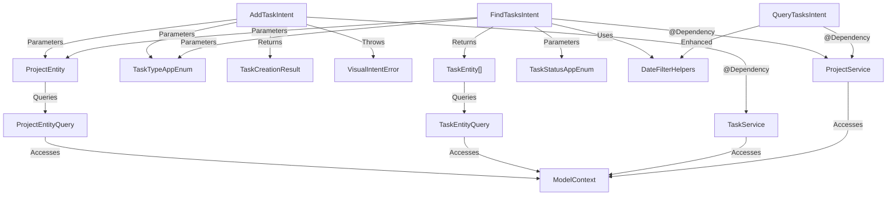

# Design: Shortcuts-Friendly Intents

## Overview

This feature enhances Transit's App Intents by adding Shortcuts-friendly visual interfaces alongside existing JSON-based CLI intents. The design follows a **dual-interface strategy**: maintaining JSON-based intents for programmatic CLI use while adding new visual intents optimized for interactive Shortcuts users.

### Key Design Principles

1. **Backwards Compatibility**: Existing JSON intents remain unchanged to protect CLI integrations
2. **Platform Conventions**: Visual intents use native Shortcuts patterns (AppEntity, AppEnum, thrown errors); JSON intents continue using string-based I/O
3. **Code Reuse**: Shared infrastructure (entities, enums, date filtering logic) serves both interface types
4. **MainActor Isolation**: Follow project's default MainActor isolation pattern with explicit `nonisolated` where needed
5. **Offline Resilience**: Leverage SwiftData's local-first architecture; intents operate on local store regardless of CloudKit sync state

### Research Sources

- [EntityQuery Protocol Documentation](https://developer.apple.com/documentation/appintents/entityquery) - Apple's official EntityQuery protocol reference
- [Creating App Intents with AppEnum](https://www.createwithswift.com/creating-an-intent-using-appintent-and-appenum-protocols/) - Practical AppEnum conformance patterns
- [Swift 6.2 Default Actor Isolation](https://www.avanderlee.com/concurrency/default-actor-isolation-in-swift-6-2/) - MainActor isolation patterns for Swift 6
- [LocalizedError Best Practices](https://nshipster.com/swift-foundation-error-protocols/) - Error handling with LocalizedError
- [SwiftData and Actor Isolation](https://killlilwinters.medium.com/taking-swiftdata-further-modelactor-swift-concurrency-and-avoiding-mainactor-pitfalls-3692f61f2fa1) - ModelContext concurrency patterns

---

## Architecture

### High-Level Structure

```
Intents/
├── JSON-Based (Existing)
│   ├── QueryTasksIntent.swift      [Enhanced with date filtering]
│   ├── CreateTaskIntent.swift      [No changes]
│   ├── UpdateStatusIntent.swift    [No changes]
│   ├── IntentError.swift           [No changes]
│   └── IntentHelpers.swift         [No changes]
│
├── Visual (New)
│   ├── AddTaskIntent.swift         [New - Shortcuts UI task creation]
│   ├── FindTasksIntent.swift       [New - Shortcuts UI task search]
│   └── VisualIntentError.swift     [New - LocalizedError conformance]
│
└── Shared Infrastructure (New)
    ├── Entities/
    │   ├── TaskEntity.swift         [AppEntity conforming struct]
    │   ├── TaskEntityQuery.swift    [EntityQuery for task lookup]
    │   ├── ProjectEntity.swift      [AppEntity for project picker]
    │   └── ProjectEntityQuery.swift [EntityQuery for project lookup]
    │
    ├── Enums/
    │   ├── TaskStatusAppEnum.swift  [AppEnum conformance extension]
    │   └── TaskTypeAppEnum.swift    [AppEnum conformance extension]
    │
    ├── Results/
    │   └── TaskCreationResult.swift [Return type for AddTaskIntent]
    │
    └── Utilities/
        └── DateFilterHelpers.swift  [Shared date range calculation logic]
```

### Dependency Flow



---

## Components and Interfaces

### 1. Enhanced QueryTasksIntent (Date Filtering)

**File**: `Transit/Transit/Intents/QueryTasksIntent.swift` (existing, to be modified)

**Changes**:
- Add date filtering support to `applyFilters()` method
- Extract date filtering logic to shared `DateFilterHelpers` for reuse
- Update parameter description to document new filter options

**New Filtering Logic**:
```swift
// Pseudocode for new date filtering in applyFilters()
if let completionFilter = json["completionDate"] as? [String: Any] {
    let dateRange = DateFilterHelpers.parseDateFilter(completionFilter)
    result = result.filter { task in
        guard let completionDate = task.completionDate else { return false }
        return DateFilterHelpers.dateInRange(completionDate, range: dateRange)
    }
}

if let statusChangeFilter = json["lastStatusChangeDate"] as? [String: Any] {
    let dateRange = DateFilterHelpers.parseDateFilter(statusChangeFilter)
    result = result.filter { task in
        DateFilterHelpers.dateInRange(task.lastStatusChangeDate, range: dateRange)
    }
}
```

**JSON Input Format for Date Filters**:
```json
{
  "completionDate": {
    "relative": "today" | "this-week" | "this-month",
    // OR
    "from": "2026-02-01",
    "to": "2026-02-11"
  },
  "lastStatusChangeDate": { /* same structure */ }
}
```

**Precedence Rules**:
- If both `relative` and absolute dates (`from`/`to`) are present, `relative` takes precedence
- If only `from` is provided, filter includes tasks with dates >= from
- If only `to` is provided, filter includes tasks with dates <= to
- If both `from` and `to` are provided, filter includes tasks within the range (inclusive)
- If filter object is empty `{}` or missing, no date filtering is applied

---

### 2. AddTaskIntent (Visual Task Creation)

**File**: `Transit/Transit/Intents/Visual/AddTaskIntent.swift` (new)

**Structure**:
```swift
struct AddTaskIntent: AppIntent {
    nonisolated(unsafe) static var title: LocalizedStringResource = "Transit: Add Task"
    nonisolated(unsafe) static var description = IntentDescription(
        "Create a new task in Transit with visual parameter entry",
        categoryName: "Tasks",
        resultValueName: "Task Creation Result"
    )
    nonisolated(unsafe) static var supportedModes: [IntentMode] = [.foreground]

    @Parameter(title: "Name")
    var name: String

    @Parameter(title: "Description")
    var taskDescription: String?

    @Parameter(title: "Type")
    var type: TaskType

    @Parameter(title: "Project")
    var project: ProjectEntity

    @Dependency
    private var taskService: TaskService

    @MainActor
    func perform() async throws -> some ReturnsValue<TaskCreationResult>
}
```

**Note on Metadata**:
Metadata is intentionally excluded from the visual AddTaskIntent. Metadata is a power-user feature primarily used by CLI/agent integrations (the reserved `git.`, `ci.`, `agent.` namespaces). Shortcuts users creating tasks interactively are unlikely to need it. Metadata remains available via the JSON-based `CreateTaskIntent`.

---

### 3. FindTasksIntent (Visual Task Search)

**File**: `Transit/Transit/Intents/Visual/FindTasksIntent.swift` (new)

**Structure**:
```swift
struct FindTasksIntent: AppIntent {
    nonisolated(unsafe) static var title: LocalizedStringResource = "Transit: Find Tasks"
    nonisolated(unsafe) static var description = IntentDescription(
        "Search for tasks with optional filters for type, project, status, and dates",
        categoryName: "Tasks",
        resultValueName: "Tasks"
    )
    nonisolated(unsafe) static var supportedModes: [IntentMode] = [.background]

    @Parameter(title: "Type")
    var type: TaskType?

    @Parameter(title: "Project")
    var project: ProjectEntity?

    @Parameter(title: "Status")
    var status: TaskStatus?

    @Parameter(title: "Completion Date")
    var completionDateFilter: DateFilterOption?

    @Parameter(title: "Last Changed")
    var lastChangedFilter: DateFilterOption?

    // Conditional parameters for completion date custom-range
    @Parameter(title: "Completed From")
    var completionFromDate: Date?

    @Parameter(title: "Completed To")
    var completionToDate: Date?

    // Conditional parameters for last changed custom-range
    @Parameter(title: "Changed From")
    var lastChangedFromDate: Date?

    @Parameter(title: "Changed To")
    var lastChangedToDate: Date?

    static var parameterSummary: some ParameterSummary {
        When(\.$completionDateFilter, .equalTo, DateFilterOption.customRange) {
            When(\.$lastChangedFilter, .equalTo, DateFilterOption.customRange) {
                // Both filters use custom-range: show all 4 date pickers
                Summary("Find tasks") {
                    \.$type
                    \.$project
                    \.$status
                    \.$completionDateFilter
                    \.$completionFromDate
                    \.$completionToDate
                    \.$lastChangedFilter
                    \.$lastChangedFromDate
                    \.$lastChangedToDate
                }
            } otherwise: {
                // Only completion uses custom-range
                Summary("Find tasks") {
                    \.$type
                    \.$project
                    \.$status
                    \.$completionDateFilter
                    \.$completionFromDate
                    \.$completionToDate
                    \.$lastChangedFilter
                }
            }
        } otherwise: {
            When(\.$lastChangedFilter, .equalTo, DateFilterOption.customRange) {
                // Only lastChanged uses custom-range
                Summary("Find tasks") {
                    \.$type
                    \.$project
                    \.$status
                    \.$completionDateFilter
                    \.$lastChangedFilter
                    \.$lastChangedFromDate
                    \.$lastChangedToDate
                }
            } otherwise: {
                // Neither uses custom-range
                Summary("Find tasks") {
                    \.$type
                    \.$project
                    \.$status
                    \.$completionDateFilter
                    \.$lastChangedFilter
                }
            }
        }
    }

    @Dependency
    private var projectService: ProjectService

    @MainActor
    func perform() async throws -> some ReturnsValue<[TaskEntity]>
}
```

**DateFilterOption Enum**:
```swift
enum DateFilterOption: String, AppEnum {
    case today
    case thisWeek = "this-week"
    case thisMonth = "this-month"
    case customRange = "custom-range"

    nonisolated static var typeDisplayRepresentation: TypeDisplayRepresentation {
        TypeDisplayRepresentation(name: "Date Filter")
    }

    nonisolated static var caseDisplayRepresentations: [DateFilterOption: DisplayRepresentation] {
        [
            .today: "Today",
            .thisWeek: "This Week",
            .thisMonth: "This Month",
            .customRange: "Custom Range"
        ]
    }
}
```

---

## Data Models

### TaskEntity (AppEntity)

**File**: `Transit/Transit/Intents/Shared/Entities/TaskEntity.swift` (new)

```swift
struct TaskEntity: AppEntity {
    var id: String  // UUID string representation

    // Core properties
    var taskId: UUID
    var displayId: Int?
    var name: String
    var status: String  // TaskStatus raw value
    var type: String    // TaskType raw value
    var projectId: UUID
    var projectName: String
    var lastStatusChangeDate: Date
    var completionDate: Date?

    // AppEntity requirements
    static var defaultQuery: TaskEntityQuery { TaskEntityQuery() }

    nonisolated static var typeDisplayRepresentation: TypeDisplayRepresentation {
        TypeDisplayRepresentation(name: "Task")
    }

    nonisolated var displayRepresentation: DisplayRepresentation {
        DisplayRepresentation(
            title: "\(name)",
            subtitle: "\(type.capitalized) • \(status.capitalized)"
        )
    }

    // Factory method from TransitTask model
    @MainActor
    static func from(_ task: TransitTask) throws -> TaskEntity {
        // Project is required in the data model; this should never be nil
        guard let project = task.project else {
            throw VisualIntentError.invalidInput("Task has no associated project (data integrity issue)")
        }

        return TaskEntity(
            id: task.id.uuidString,
            taskId: task.id,
            displayId: task.permanentDisplayId,
            name: task.name,
            status: task.statusRawValue,
            type: task.typeRawValue,
            projectId: project.id,
            projectName: project.name,
            lastStatusChangeDate: task.lastStatusChangeDate,
            completionDate: task.completionDate
        )
    }
}
```

### TaskEntityQuery

**File**: `Transit/Transit/Intents/Shared/Entities/TaskEntityQuery.swift` (new)

```swift
struct TaskEntityQuery: EntityQuery {
    @Dependency
    private var projectService: ProjectService

    @MainActor
    func entities(for identifiers: [String]) async throws -> [TaskEntity] {
        let uuids = identifiers.compactMap { UUID(uuidString: $0) }

        // Fetch all tasks and filter in-memory (SwiftData predicate limitations with array contains)
        let descriptor = FetchDescriptor<TransitTask>()
        let allTasks = try projectService.context.fetch(descriptor)
        let matchingTasks = allTasks.filter { uuids.contains($0.id) }

        // Use compactMap to gracefully skip tasks without projects (CloudKit sync edge case)
        return matchingTasks.compactMap { try? TaskEntity.from($0) }
    }

    @MainActor
    func suggestedEntities() async throws -> [TaskEntity] {
        // Return recent tasks for suggestion
        let descriptor = FetchDescriptor<TransitTask>(
            sortBy: [SortDescriptor(\.lastStatusChangeDate, order: .reverse)]
        )
        let tasks = try projectService.context.fetch(descriptor)

        // Use compactMap to gracefully skip tasks without projects (CloudKit sync edge case)
        return Array(tasks.prefix(10)).compactMap { try? TaskEntity.from($0) }
    }
}
```

### ProjectEntity (AppEntity)

**File**: `Transit/Transit/Intents/Shared/Entities/ProjectEntity.swift` (new)

```swift
struct ProjectEntity: AppEntity {
    var id: String  // UUID string representation
    var projectId: UUID
    var name: String

    static var defaultQuery: ProjectEntityQuery { ProjectEntityQuery() }

    nonisolated static var typeDisplayRepresentation: TypeDisplayRepresentation {
        TypeDisplayRepresentation(name: "Project")
    }

    nonisolated var displayRepresentation: DisplayRepresentation {
        DisplayRepresentation(title: "\(name)")
    }

    @MainActor
    static func from(_ project: Project) -> ProjectEntity {
        ProjectEntity(
            id: project.id.uuidString,
            projectId: project.id,
            name: project.name
        )
    }
}
```

### ProjectEntityQuery

**File**: `Transit/Transit/Intents/Shared/Entities/ProjectEntityQuery.swift` (new)

```swift
struct ProjectEntityQuery: EntityQuery {
    @Dependency
    private var projectService: ProjectService

    @MainActor
    func entities(for identifiers: [String]) async throws -> [ProjectEntity] {
        let uuids = identifiers.compactMap { UUID(uuidString: $0) }
        return projectService.allProjects
            .filter { uuids.contains($0.id) }
            .map(ProjectEntity.from)
    }

    @MainActor
    func suggestedEntities() async throws -> [ProjectEntity] {
        return projectService.allProjects.map(ProjectEntity.from)
    }
}
```

### TaskCreationResult

**File**: `Transit/Transit/Intents/Shared/Results/TaskCreationResult.swift` (new)

```swift
struct TaskCreationResult {
    var taskId: UUID
    var displayId: Int?
    var status: String  // Always "idea" per requirements
    var projectId: UUID
    var projectName: String
}
```

### AppEnum Conformances

**File**: `Transit/Transit/Intents/Shared/Enums/TaskStatusAppEnum.swift` (new)

```swift
extension TaskStatus: AppEnum {
    nonisolated public static var typeDisplayRepresentation: TypeDisplayRepresentation {
        TypeDisplayRepresentation(name: "Status")
    }

    nonisolated public static var caseDisplayRepresentations: [TaskStatus: DisplayRepresentation] {
        [
            .idea: "Idea",
            .planning: "Planning",
            .spec: "Spec",
            .readyForImplementation: "Ready for Implementation",
            .inProgress: "In Progress",
            .readyForReview: "Ready for Review",
            .done: "Done",
            .abandoned: "Abandoned"
        ]
    }
}
```

**File**: `Transit/Transit/Intents/Shared/Enums/TaskTypeAppEnum.swift` (new)

```swift
extension TaskType: AppEnum {
    nonisolated public static var typeDisplayRepresentation: TypeDisplayRepresentation {
        TypeDisplayRepresentation(name: "Type")
    }

    nonisolated public static var caseDisplayRepresentations: [TaskType: DisplayRepresentation] {
        [
            .bug: "Bug",
            .feature: "Feature",
            .chore: "Chore",
            .research: "Research",
            .documentation: "Documentation"
        ]
    }
}
```

---

## Error Handling

### VisualIntentError (LocalizedError)

**File**: `Transit/Transit/Intents/Visual/VisualIntentError.swift` (new)

```swift
enum VisualIntentError: LocalizedError {
    case noProjects
    case invalidInput(String)
    case invalidDate(String)
    case projectNotFound(String)
    case taskNotFound(String)
    case taskCreationFailed(String)

    var errorDescription: String? {
        switch self {
        case .noProjects:
            return "No projects exist. Create a project in Transit first."
        case .invalidInput(let hint):
            return "Invalid input: \(hint)"
        case .invalidDate(let hint):
            return "Invalid date: \(hint)"
        case .projectNotFound(let hint):
            return "Project not found: \(hint)"
        case .taskNotFound(let hint):
            return "Task not found: \(hint)"
        case .taskCreationFailed(let hint):
            return "Task creation failed: \(hint)"
        }
    }

    var failureReason: String? {
        switch self {
        case .noProjects:
            return "Transit requires at least one project to create tasks."
        case .invalidInput:
            return "The provided input is missing required fields or contains invalid data."
        case .invalidDate:
            return "The date format is incorrect or the date range is invalid."
        case .projectNotFound:
            return "The selected project no longer exists in the database."
        case .taskNotFound:
            return "The specified task could not be found."
        case .taskCreationFailed:
            return "An unexpected error occurred while creating the task."
        }
    }

    var recoverySuggestion: String? {
        switch self {
        case .noProjects:
            return "Open Transit and create a project before using this Shortcut."
        case .invalidInput:
            return "Check that all required fields are filled in correctly."
        case .invalidDate:
            return "Verify the date format (YYYY-MM-DD) or select a valid date range."
        case .projectNotFound:
            return "Select a different project or create a new one in the app."
        case .taskNotFound:
            return "The task may have been deleted. Try searching for it in the app."
        case .taskCreationFailed:
            return "Check that the app has sufficient storage and try again. If the problem persists, restart the app."
        }
    }
}
```

### Error Handling Strategy

**JSON Intents** (existing pattern, no changes):
- Return error strings via `IntentError.json` property
- Errors are encoded as JSON: `{"error": "CODE", "message": "..."}`
- CLI callers parse JSON to detect errors

**Visual Intents** (new pattern):
- Throw `VisualIntentError` conforming to `LocalizedError`
- Shortcuts displays errors natively with system UI
- Users see `errorDescription`, `failureReason`, and `recoverySuggestion`

---

## Date Filtering Implementation

### DateFilterHelpers Utility

**File**: `Transit/Transit/Intents/Shared/Utilities/DateFilterHelpers.swift` (new)

```swift
@MainActor
enum DateFilterHelpers {
    enum DateRange {
        case today
        case thisWeek
        case thisMonth
        case absolute(from: Date?, to: Date?)
    }

    /// Parse JSON date filter into DateRange
    static func parseDateFilter(_ json: [String: Any]) -> DateRange? {
        if let relative = json["relative"] as? String {
            switch relative {
            case "today": return .today
            case "this-week": return .thisWeek
            case "this-month": return .thisMonth
            default: return nil
            }
        }

        if let fromString = json["from"] as? String,
           let toString = json["to"] as? String {
            let from = dateFromString(fromString)
            let to = dateFromString(toString)
            return .absolute(from: from, to: to)
        }

        if let fromString = json["from"] as? String {
            return .absolute(from: dateFromString(fromString), to: nil)
        }

        if let toString = json["to"] as? String {
            return .absolute(from: nil, to: dateFromString(toString))
        }

        return nil
    }

    /// Check if a date falls within a range
    static func dateInRange(_ date: Date, range: DateRange) -> Bool {
        let calendar = Calendar.current

        switch range {
        case .today:
            return calendar.isDateInToday(date)

        case .thisWeek:
            guard let weekInterval = calendar.dateInterval(of: .weekOfYear, for: Date()) else {
                return false
            }
            return date >= weekInterval.start && date <= Date()

        case .thisMonth:
            guard let monthInterval = calendar.dateInterval(of: .month, for: Date()) else {
                return false
            }
            return date >= monthInterval.start && date <= Date()

        case .absolute(let from, let to):
            let normalizedDate = calendar.startOfDay(for: date)

            if let from, let to {
                let normalizedFrom = calendar.startOfDay(for: from)
                let normalizedTo = calendar.startOfDay(for: to)
                return normalizedDate >= normalizedFrom && normalizedDate <= normalizedTo
            }

            if let from {
                let normalizedFrom = calendar.startOfDay(for: from)
                return normalizedDate >= normalizedFrom
            }

            if let to {
                let normalizedTo = calendar.startOfDay(for: to)
                return normalizedDate <= normalizedTo
            }

            return true
        }
    }

    /// Convert YYYY-MM-DD string to Date in local timezone
    private static func dateFromString(_ string: String) -> Date? {
        let formatter = DateFormatter()
        formatter.dateFormat = "yyyy-MM-dd"
        formatter.calendar = Calendar.current
        formatter.timeZone = TimeZone.current
        return formatter.date(from: string)
    }
}
```

### Visual Intent Date Filtering

For `FindTasksIntent`, date filtering uses `DateFilterOption` enum and native Date pickers:

```swift
// Convert DateFilterOption + Date parameters to DateRange
private func buildDateRange(
    option: DateFilterOption?,
    from: Date?,
    to: Date?
) -> DateFilterHelpers.DateRange? {
    guard let option else { return nil }

    switch option {
    case .today: return .today
    case .thisWeek: return .thisWeek
    case .thisMonth: return .thisMonth
    case .customRange:
        return .absolute(from: from, to: to)
    }
}
```

### Result Limiting and Truncation

**FindTasksIntent** limits results to 200 tasks maximum:

```swift
@MainActor
func perform() async throws -> some ReturnsValue<[TaskEntity]> {
    // Fetch and filter tasks...
    let filtered = applyFilters(allTasks)

    // Sort by lastStatusChangeDate descending
    let sorted = filtered.sorted { $0.lastStatusChangeDate > $1.lastStatusChangeDate }

    // Limit to 200 tasks (silent truncation)
    let limited = Array(sorted.prefix(200))

    return .result(value: try limited.map { try TaskEntity.from($0) })
}
```

**Truncation Behavior**:
- Results are **silently truncated** to 200 tasks with no user indication
- Sorting occurs **before limiting** to ensure most recently changed tasks are returned
- If a user has >200 matching tasks, they receive the 200 most recent
- **Design Decision**: Silent truncation is acceptable for V1; pagination can be added later if needed

---

## Testing Strategy

### Unit Tests

**File Structure**:
```
TransitTests/
├── DateFilterHelpersTests.swift
├── AddTaskIntentTests.swift
├── FindTasksIntentTests.swift
├── TaskEntityTests.swift
├── ProjectEntityTests.swift
└── VisualIntentErrorTests.swift
```

**DateFilterHelpersTests** (parameterized testing):
- **Test cases**:
  - **Idempotence**: `dateInRange(date, range)` should return the same result on repeated calls
  - **Boundary inclusivity**: For absolute ranges, dates exactly on `from` or `to` should be included
  - **Relative range consistency**: "today" should include any time from 00:00:00 to 23:59:59
  - **Timezone consistency**: All date comparisons use `Calendar.current` with local timezone
- **Framework**: Use Swift Testing's `#expect()` with parameterized test tables
- **Input generation**: Test with dates spanning multiple timezones, DST boundaries, month/year boundaries
- **Example**:
  ```swift
  @Test("Date in range is idempotent", arguments: [
      (Date(), DateFilterHelpers.DateRange.today),
      (Date().addingTimeInterval(-86400), .thisWeek),
      // ... more cases
  ])
  func dateInRangeIdempotence(date: Date, range: DateFilterHelpers.DateRange) {
      let result1 = DateFilterHelpers.dateInRange(date, range: range)
      let result2 = DateFilterHelpers.dateInRange(date, range: range)
      #expect(result1 == result2)
  }
  ```

**AddTaskIntentTests**:
- Test task creation with all parameter combinations
- Test metadata parsing (valid, invalid, empty)
- Test error throwing when no projects exist
- Test integration with TaskService

**FindTasksIntentTests**:
- Test filtering by each parameter individually
- Test AND logic (multiple filters applied together)
- Test empty results handling
- Test 200-task result limit
- Test sort order (lastStatusChangeDate descending)

**Entity and Query Tests**:
- Test TaskEntity/ProjectEntity creation from model objects
- Test EntityQuery `entities(for:)` with valid/invalid UUIDs
- Test `suggestedEntities()` returns expected results

**Error Tests**:
- Test VisualIntentError provides proper LocalizedError strings
- Test errorDescription, failureReason, recoverySuggestion for each case

### Integration Tests

**QueryTasksIntent Date Filtering**:
- Create tasks with various completion dates
- Test "today", "this-week", "this-month" filters return correct results
- Test absolute date ranges with from/to combinations
- Test filters exclude tasks with nil dates

**Full Intent Flow**:
- Use TestModelContainer for in-memory SwiftData
- Test AddTaskIntent → creates task → FindTasksIntent retrieves it
- Test AddTaskIntent throws error when no projects exist

### Manual Testing (Shortcuts App)

**AddTaskIntent**:
- Verify project dropdown populates from existing projects
- Verify type dropdown shows all TaskType options
- Verify error message when no projects exist
- Verify app opens after task creation

**FindTasksIntent**:
- Verify conditional parameters (from/to dates) appear when custom-range selected
- Verify empty results return empty array (not error)
- Verify app does NOT open after query
- Verify results display with proper displayRepresentation

---

## Implementation Notes

### Swift 6 Concurrency Patterns

1. **MainActor Isolation**: All intents use `@MainActor func perform()` to access ModelContext safely
2. **nonisolated statics**: AppEntity/AppEnum static properties marked `nonisolated` to avoid isolation conflicts
3. **@Dependency Injection**: Uses project's existing pattern for ModelContext access via services

### CloudKit and Offline Behavior

- **Intents operate on local SwiftData store** - no direct CloudKit access
- **Display ID allocation** in AddTaskIntent may fail offline → returns provisional ID
- **No special offline handling needed** - SwiftData handles sync transparently

### Performance Considerations

- **200-task limit** in FindTasksIntent prevents performance issues
- **Sorting before limiting** ensures most recent tasks returned
- **In-memory filtering** after SwiftData fetch (no complex predicates needed for date filters)

### File Organization

Group new files logically:
- `Intents/Visual/` - AddTaskIntent, FindTasksIntent, VisualIntentError
- `Intents/Shared/Entities/` - TaskEntity, TaskEntityQuery, ProjectEntity, ProjectEntityQuery
- `Intents/Shared/Enums/` - AppEnum conformance extensions
- `Intents/Shared/Results/` - TaskCreationResult
- `Intents/Shared/Utilities/` - DateFilterHelpers

This structure makes the dual-interface strategy clear while maximizing code reuse between JSON and visual intents.
