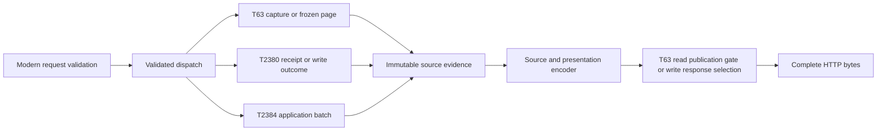

# Structured MCP results: design

Status: approved by owner “2383 and 2384 are approved” (parent-verified Sentinel_717be95229c48191a7c41b6e5e467e4c), covering T2383 design commit 7970a9c. Requirements approved at Sentinel_39b0ca45b1b8819180ac6d9600578f0b. Task plan b58298a and implementation approved by parent-verified Sentinel_ba4c6123288881918042d6aeb8ba6dc5; common-file edits wait for handoff and heavy builds/tests for the shared slot.

## Architecture

One immutable source supplies both compatible text and a versioned structured wrapper. Presentation derives only from that source and explicit execution evidence. The modern HTTP boundary validates before dispatch, and T-63 selects fully encoded read results together with retention publication.



### Result boundary

`structuredContent` has the following contract. `contractVersion` identifies this presentation contract; a protected write's own `contractVersion` remains inside `source.payload`. The source can be an object, array, scalar or null. `content` retains the existing text string; outer `isError` retains its optional presence and value. `_meta` remains the existing independent T-63 metadata boundary.

```json
{
  "resultType": "complete",
  "content": [{"type": "text", "text": "<original text string>"}],
  "structuredContent": {
    "contractVersion": 1,
    "source": {"kind": "json", "payload": "<original JSON value, not a JSON string copy>"},
    "presentation": {
      "evidence": "established",
      "links": [{"entityType": "task", "entityId": "<UUID>",
                 "sourcePath": "/record", "availability": "unavailable",
                 "reason": "navigation_not_supported"}]
    }
  }
}
```

The example's payload marker is illustrative; an actual write embeds its original object and a query embeds its original page object/array. `source.kind` is `json`, `text`, or `unreadable`. `json` requires `payload`; `text` requires the original plain message as a JSON string payload. `unreadable` prohibits `payload` and leaves available raw evidence in `content`. Empty strings and JSON null are distinct from missing payload. `presentation.evidence` is `established` when the provider has established its result, or `unestablished` when retained evidence cannot establish an outcome. It is not a fresh storage-validity check and does not assert that an uncertain write committed.

For parseable but unsupported retained outcomes, preserve their whole JSON payload and use `evidence:unestablished`; for malformed retained JSON preserve raw text and original optional `isError`, use `kind:unreadable`, and put diagnostics in presentation. Malformed generated JSON throws a source-adaptation failure: covered reads select T-63's preencoded serialization_failure with isError true and publish no records/cursor/snapshot; effectful writes select their prepared effect-aware fallback. The retained-JSON unreadable branch never substitutes for a generated-success failure. Known plain-text tool errors use `kind:text`, not unreadable evidence. Never classify by attempting JSON parse and then assuming any failure is an ordinary message: the provider declares its source origin. Receipt lookup failure without accessible original bytes uses the existing uncertainty result; the adapter does not bypass receipt validation to retrieve corrupt records.

Unknown source field names are unconstrained and cannot collide with presentation. Do not insert link/category fields into records or receipt JSON. Do not create a new durable result store, acceptance state, namespace, or replay expiry.

### Approved nesting resource limit

Owner amendment Sentinel_9536d4df532c81919792e70801f128fb sets maximum parser-input container nesting32. Count root object/array1 and each contained object/array another level; scalar roots/children add0. Use a distinct resourceLimit failure, not invalidJSON for syntactically valid deeper data. Generated source depth>32 throws before successful publication and follows the existing generated-serialization/effect-aware failure path. Retained depth>32 preserves exact raw text and optional isError but returns unreadable/unestablished evidence; it does not rewrite receipts, reread entities or fabricate acceptance/outcome. Checkpoints still propagate and are never swallowed as unreadable evidence.

Test31/32 accepted,33 resourceLimit, wide2000-record arrays accepted subject to existing byte/admission budgets. Iterative parsing plus this cap bounds recursive value equality/destruction. The cap applies separately to each parser input, including logical sources, protocol request documents and schema documents; modern result nesting gains wrapper levels, so verify full wire response and schema depths separately rather than claiming an output-depth32 guarantee. Unknown historical JSON deeper than32 is an explicit interpretation exception to whole-payload structured access, with exact original text preservation.

### Immutable source and encoding interfaces

New macOS modules live in `Transit/Transit/MCP/Results/`. These are design-level names and contracts; shared-file signatures are installed only after the T-63 handoff.

```swift
nonisolated struct MCPResultSource: Sendable {
    let originalText: String
    let originalIsError: Bool? // nil, false, true preserved distinctly
    let document: MCPJSONDocument? // owned UTF-8 and lossless parsed value
    let kind: MCPResultSourceKind // json / text / unreadable
    let evidence: MCPResultEvidence // established / unestablished
}
nonisolated struct MCPResultContext: Sendable {
    let tool: String
    let semanticFailure: MCPResultFailure? // explicit provider evidence, not message matching
    let mutationRecovery: MCPMutationRecoveryContext? // protected, batch or maintenance evidence
    let entityPositions: [MCPResultEntityPosition] // provider-declared source pointers for its own shapes
}
nonisolated struct MCPResultPresentation: Sendable {
    let evidence: MCPResultEvidence
    let links: [MCPUnavailableLink]
    let errorCategory: MCPResultErrorCategory?
    let recovery: MCPResultRecovery? // supplement only; never replaces original retryAction
}
nonisolated enum MCPResultAdapter {
    static func source(text: String, isError: Bool?, origin: MCPResultOrigin,
                       evidence: MCPResultEvidence) throws -> MCPResultSource
    static func present(_ source: MCPResultSource,
                        context: MCPResultContext) -> MCPResultPresentation
}
nonisolated enum MCPResultEncoder {
    static func encode(source: MCPResultSource, presentation: MCPResultPresentation,
                       id: JSONRPCId, metadata: MCPResultMetadata?) throws -> Data
    static func prepareMutationFallback(id: JSONRPCId, source: MCPResultSource,
                       context: MCPResultContext, metadata: MCPResultMetadata?) throws -> Data
}
```

`MCPJSONDocument.swift` validates one complete UTF-8 JSON value and owns a lossless value tree with number tokens retained as validated decimal lexemes. The scanner preserves object members, nulls, array order, strings and unknown fields; rejects duplicate object keys, invalid escapes/UTF-8, trailing tokens and malformed numbers as ambiguous/unreadable evidence. Parsing is iterative with periodic cancellation/deadline checks in covered-read workers; no model objects or unchecked `Any` cross the actor boundary. Preserve large integers/exponents and Boolean versus number without a Double conversion. Encoding inserts only the validated original JSON fragment as `source.payload`; all surrounding strings/keys/metadata are safely JSON-encoded. The document's inspected tree and inserted fragment must represent the same complete value. The writer does not accept an arbitrary raw string as a JSON fragment. Existing `MCPCanonicalJSON` request/revision algorithms remain untouched.

`MCPMutationRecoveryContext` distinguishes protected(tool/key), applicationBatch(provider-supplied original item keys), and unprotectedMaintenance(tool), without introducing a maintenance key. `prepareMutationFallback` accepts the provider's compact logical failure source and produces final immutable bytes before dispatch; it does not execute the provider. `MCPResultSource.swift` contains origin/evidence/recovery value types and factories. `MCPResultAdapter.swift` owns presentation and source selectors; `MCPResultEncoder.swift` owns complete response bytes and preencoded recovery failures; `MCPResultSchemas.swift` owns output-schema descriptors. Provider adapters attach declared source origin and semantic error evidence at construction, rather than inferring intent from localized prose. Parsing/inspection/encoding run once per newly produced logical result; retained pages store the frozen derived form. Large destruction happens outside T-63's publication lock.

`MCPToolResult` gains structured content and `resultType` in T-63-owned wiring. Every tool result passes through this adapter exactly once, including maintenance tools and persistence-unavailable failures. Provider-level results stay logical values until the outer RPC ID/metadata is known; retaining a tool result never retains an old JSON-RPC ID. A raw JSON fragment is encoded by the new result byte writer, not through `AnyCodable`'s Double fallback.

T-2384 supplies its own versioned aggregate logical JSON plus compatible generated text and aggregate optional `isError`. The adapter treats it as one source; it does not flatten or reconstruct nested original item results. T-2384's per-item JSON/text/optional isError/evidence remain batch-owned. A missing/null/false `isError` in original evidence must remain distinct. The common factory returns explicit unreadable/unestablished evidence, permitting T-2384 to stop its prefix without fabricating an item outcome. The common encoder can preencode T-2384's compact logical fallback (`summary:serialization_failed`, effect evidence unestablished, original item keys/indexes for recovery) before effects with original item keys; it does not decide batch execution/continuation semantics or invent a durable batch key.

### Replay, normalization and link selection

`MCPWriteCoordinator.stageTerminal` continues saving the original result JSON and Boolean before the atomic domain/result save; `replay` returns those saved bytes and mapped optional isError. The adapter is downstream of terminal receipt validation and never rereads an entity. For generated writes it uses the saved-record snapshot, not request arguments. Failure to present a retained result never reruns that write or rewrites its receipt.

Ordinary and reusable cursor stores retain original text, validated source/presentation fragments, and the original capture metadata with each frozen page. They retain tool-result bytes independent of request IDs and encode only the new outer RPC envelope on continuation. Link/category construction uses frozen evidence once, not current model reads or wall time. Add retained UTF-8/encoded fragment bytes and metadata to each store's existing 16-MiB accounting, preserving its existing capture/index charges, including all privately prepared pages before publication; avoid double-counting shared immutable backing. Ordinary and reusable stores retain their separate eight-snapshot/five-minute bounds. If expanded bytes do not fit, fail capacity before exposing any cursor/snapshot; no eviction or truncation added.

Link selector tables recognize only documented entity positions for each tool: task/project record, currentRecord, recordBeforeDeletion, query `results`, project-list records, and T-2382/T-2384 provider-supplied typed entity positions. Provider entity positions carry source pointers/entity type for their own documented shapes; the adapter checks the indicated identity token against the same immutable document. Each link identifies the source JSON Pointer, UUID and entity type; traversal order follows source arrays, with source-pointer/entity-type/UUID ordering for object positions. Relationship references use their own pointer (for example /record/projectId), avoiding pointer ambiguity with the task record itself. No recursive guess that every `id` or unknown field is an entity. Task project references use the saved `projectId`, including on omitted-comment records. Missing/malformed identity yields no invented entry. Every identified task/project position has an `unavailable` entry and no URI. Milestones/comments have no fabricated task/project identity. T-572 URL opening and registration remain outside this design.

Saved-field normalization is path-specific and documented in `docs/mcp-result-contract.md` from the actual protected write path:

| Protected path | Existing normalization authority |
| --- | --- |
| create_task / create_milestone | Service creation trims name; description is passed through, preserving surrounding/internal whitespace and newlines when provided. |
| create_project | ProjectService trims name; description is passed through (omitted becomes the existing empty string default). |
| update_task | TaskUpdateValidator trims name and description with whitespacesAndNewlines; omitted description is unchanged, empty-after-trim clears it; internal newlines survive. Metadata remains strict replacement/clear under the validator. |
| update_milestone | MCPWriteCommand.applyMilestone trims name/description; omitted description unchanged, empty-after-trim clears it; internal newlines survive. |
| add_comment / update_task_status with comment | CommentService trims stored content and author; status command's existing empty-comment/author validation remains authoritative. |

Do not project create/direct-service normalization onto update paths. Responses use `MCPRecordSnapshot`, not a second normalizer. Parent display labels (`projectName`, `milestoneName`) are associated display data outside task revision coverage. Revision-covered field comparison excludes those labels, keeps comment-covered r1 when bodies are omitted, and uses the captured/readback saved fields at the same covered revision. Historical source absent/null distinctions are never changed to satisfy a newer shape.

### Error and recovery rules

The presentation category is finite and separate from original code/message/outcome/accepted/retryAction. Prefer explicit provider failure phase; retained writes can use their validated known code/outcome. Unknown historic codes map to `unclassified_historical`, not to a retry promise. Source uncertainty or unestablished evidence takes precedence over a superficially no-effect-looking code. Source retryAction remains authoritative; contradictory or unsupported evidence becomes unestablished/reconcile rather than silently normalized.

| Category | Evidence / examples | Supplemental recovery constraint |
| --- | --- | --- |
| invalid_input | INVALID_INPUT, invalid tool fields | Correct input; new key only if original write evidence establishes no effect and directs it. |
| not_found / ambiguous_identity | TASK_NOT_FOUND, PROJECT_NOT_FOUND, duplicate selector identifiers | Correct selector; never infer prior write effect from current absence. |
| revision_conflict / key_conflict | REVISION_CONFLICT / IDEMPOTENCY_KEY_REUSED | Preserve currentRecord/revision and original retryAction; changed arguments do not reuse a bound key. |
| storage_failure / incoherent_capture | T-63 explicit capture phase, PERSISTENCE_UNAVAILABLE | Identical read retry; writes follow original acceptance/retry evidence. |
| admission_busy / deadline_exceeded / retention_capacity | T-63 READ_BUSY/READ_TIMEOUT; ordinary QUERY_CAPACITY_EXCEEDED and reusable equivalents | No publication. Retry read under provider policy; unchanged write recovery only. |
| invalid_cursor / expired_cursor | INVALID_CURSOR; QUERY_EXPIRED or explicit retained-view expiry | Start a new read; unknown/expired token ambiguity is documented under invalid_cursor. |
| serialization_failure | explicit parser/encoder phase before a complete read | No partial read/publication. For writes possibly committed, use uncertain recovery instead. |
| outcome_uncertain | OUTCOME_UNCERTAIN, may-commit delivery/encoding failure | Original tool/key evidence and reconciliation; never fresh-key advice. |
| unclassified_historical / internal_failure | unknown retained code / explicit unclassified new internal failure | No safe retry inferred; inspect source and reconcile uncertain writes. |

`recovery` describes `follow_source`, `retry_identical_read`, `restart_read`, or `reconcile_original_write`, or `reconcile_maintenance`; original protected tool/key may be included only from trusted request/receipt evidence. It cannot rewrite `source.payload.retryAction`. Failures required for a complete read return the established provider error alone, with no successful records/cursor/snapshot; explicit missing-selector result entries remain successful defined data. No swallowing comment/capture errors as empty collections.

Before dispatching a protected write, prepare a compact modern tool-error response correlated to the current RPC ID and original key with outcome uncertainty/reconcile guidance. If final presentation/encoding fails after possible commitment, select that preencoded fallback rather than the generic `MCPServer.jsonResponse` internal-error path. The fallback reports unavailable delivery evidence rather than claiming the saved receipt is corrupt; the unchanged receipt remains replayable with its original key. Never modify the saved receipt to record presentation failure. If fallback preparation fails before dispatch, return a protocol internal error and execute no write. Actual delivery failure sends nothing further; the caller recovers using the original key. Batch fallback is prepared before its first effect using T-2384's compact aggregate supplied to this encoder; a later failure selects that complete aggregate and preserves known original keys without guessing which unreported item committed.

The effectful maintenance tool `reassign_duplicate_display_ids` prepares a complete correlated modern uncertainty fallback before dispatch. It contains no invented key/accepted binding and reports possible partial effects with `reconcile_maintenance`; recovery requires a fresh `scan_duplicate_display_ids` and inspection of changed identifiers before any further reassignment. `handleReassignDuplicateDisplayIds` must surface its inner encodeAsJSONString failure with may-have-effects evidence to response selection, instead of converting it to an ordinary plain errorResult; both that provider-level failure and final envelope encoding failure select those already encoded bytes; fallback preparation failure prevents reassignment. Delivery loss carries no safe repeat guarantee. The scan itself remains a read outside T-63 freshness/admission scope. The same effect-aware rule covers every future enabled unprotected mutation added to this result boundary.

## Modern protocol boundary

Use [MCP 2026-07-28](https://modelcontextprotocol.io/specification/2026-07-28/basic/index), [discovery](https://modelcontextprotocol.io/specification/2026-07-28/server/discover), [HTTP](https://modelcontextprotocol.io/specification/2026-07-28/basic/transports/streamable-http), and [subscriptions](https://modelcontextprotocol.io/specification/2026-07-28/basic/patterns/subscriptions) as normative wire definitions. New pure types/validation live in `MCP/Protocol/MCPModernRequest.swift`, `MCPModernValidator.swift` and `MCPModernDiscovery.swift`; existing router/handler/notification hooks remain T-63 owned until handoff. Do not negotiate optional features from prior requests, connection identity or session state.

POST processing order: loopback Origin/Host validation → JSON content-type/response-format negotiation → bounded body read (existing 1 MiB) → single-object JSON-RPC structural validation → request ID/method classification → metadata/header validation → immutable method/tool-name availability classification → T-63 covered-read admission → covered tool-domain argument validation and dispatch. Noncovered tools use normal effect-aware dispatch after protocol validation. Covered argument checks remain inside their bounded worker even when invalid; do not hop to MainActor or call live storage/availability callbacks before admission. Use a frozen availability snapshot for transport classification. Invalid requests never reserve write keys or capture storage. HTTP fixtures send the standard Accept listing application/json and text/event-stream. Reject unsupported request Content-Type with 415 and an unacceptable response format with 406 before dispatch; ordinary results use application/json and subscriptions require acceptable SSE. Modern error responses echo a readable valid request ID; when no valid ID can be read, omit id instead of fabricating null. An Origin rejection is 403 before decoding, without a fabricated RPC ID. Case-insensitive header names have case-sensitive values; duplicated/conflicting required headers are rejected. Decode the standard `=?base64?...?=` Mcp-Name sentinel before comparing it to the body tool name; validate UTF-8/ASCII rules. Transit adds no custom mirrored parameter headers. `params._meta` requires protocolVersion and clientCapabilities object, permits absent clientInfo, and validates supplied known capability fields; unknown extension metadata remains tolerated. The server requires no optional client capability for its ordinary complete tool results.

| Boundary | HTTP / RPC disposition |
| --- | --- |
| Malformed JSON / non-object or array / invalid JSON-RPC envelope or ID | 400; -32700 parse error or -32600 invalid request; use readable valid ID where available. No array dispatch. |
| Missing/malformed required per-request metadata | 400; -32602. |
| Missing/malformed/mismatched required version/method/name headers | 400; -32020 HeaderMismatch. |
| Valid matching version values other than 2026-07-28 | 400; -32022, data `{requested, supported:["2026-07-28"]}`. |
| A genuinely required optional capability absent | 400; -32021 with requiredCapabilities; ordinary Transit methods do not manufacture such a requirement. |
| Unknown method, including initialize/ping legacy methods | 404; -32601 after modern boundary validation. |
| tools/call missing/disabled name or malformed params | Defined -32602 protocol error; no tool effects. Tool-domain failures use complete tool result + isError. |
| GET/DELETE / unacceptable method | 405; Allow: POST; no session header and no SSE GET. |
| Notification-shaped request-only method or unsupported client notification | 400 with no JSON-RPC response to a notification; no dispatch/effects. Current core HTTP methods accept no client notifications. |
| Valid ordinary request | 200 application/json complete result or defined JSON-RPC error. |

Header/body mismatch takes precedence over unsupported-version negotiation when both present disagree. Metadata shape is checked before comparing headers; remaining tool argument-validation precedence is the existing contract inside the covered worker; admission never waits on argument validation. Removing legacy transport does not alter application batch semantics: T-2384 remains one tools/call, not a wire array. Do not add session state, Last-Event-ID resumption, sampling/elicitation, resource/prompt tools, or progress channels.

`server/discover` returns resultType complete, supportedVersions `["2026-07-28"]`, tools capability, and serverInfo under `_meta["io.modelcontextprotocol/serverInfo"]`. `tools/list` returns resultType complete, current enabled definitions sorted by stable tool name, and each outputSchema. Both advertise `ttlMs:0`, `cacheScope:"public"`: local metadata is not client-personalized and clients must refresh rather than retain stale settings-dependent definitions. Tool availability changes still publish subscribed invalidation. Do not mix serverInfo with T-63 read metadata.

`MCPResultSchemas` provides a common self-contained JSON Schema 2020-12 wrapper (`$schema` explicit, local `$defs` only). Its `oneOf` constrains json/text/unreadable source variants, presence of payload and presentation enums/links/recovery; `source.payload` for JSON accepts any JSON value and unknown historic fields. Per-tool descriptions and examples document current record/write shapes without narrowing a historic replay into an incompatible success-only schema. T-2384 can describe its current aggregate payload within its provider descriptor, while the common retained-source branch stays permissive. No network $ref dereferencing or production general-purpose schema validator is added; schema conformance is checked in targeted test fixtures with a standards-compliant 2020-12 validator available in the test environment.

### POST subscription stream

`subscriptions/listen` requires a valid request ID, modern metadata/headers, and an Accept value permitting text/event-stream. Validate notification filter types, acknowledge only supported `toolsListChanged:true`; other valid unsupported filter fields are omitted. An empty supported subset is allowed. Register one request-scoped stream, with an acknowledgement queued before making it eligible for availability notifications. Ack uses `notifications/subscriptions/acknowledged`, params.notifications containing the accepted subset, and params._meta[`io.modelcontextprotocol/subscriptionId`] equal to the original RPC ID. All list-change notifications carry the same ID. Multiple streams receive their own filtered notification; remove the old once-per-session grouping.

A bounded stream queue protects the first acknowledgement from replacement by list invalidation; repeated list invalidations can coalesce after acknowledgement because they instruct refresh, not data replay. SSE uses `data:` JSON messages with immediate flush and no event IDs. Existing tool availability observer calls feed the broadcaster. Disconnect removes its registration exactly once and sends no further messages. Server-initiated shutdown sends the original request's complete result with subscription metadata when the stream can still accept it, then closes; teardown releases all registrations even if that final send fails. Optional keep-alive comments carry no protocol data. No read permit is assigned to this long-lived subscription; it captures no store view and does not change T-63's covered-read capacity.

## Shared ownership and parity audit

T-63 completes its approved capture/admission/publication work first. T-2383 integrates only after a coordinated common-file handoff against that landed interface; if common ownership remains active, implement isolated modules/tests after implementation approval and defer shared wiring. The handoff records symbols/files, base commit, owner and retained concurrency invariants. T-2382 retains aggregation/store policy; T-2384 retains batch operation/effect/fallback policy. This spec does not edit their approved documents or widen T-63's read deadline to batch dry-run.

| Call site or consumer | Equivalent needed | Owner / hook |
| --- | --- | --- |
| MCPToolHandler.textResult/errorResult; validation and persistence-unavailable paths | yes | T-63 hook declares source origin/failure; T-2383 adapter handles both JSON and plain text. |
| MCPWriteOutcome.result; coordinator.stageTerminal/replay | yes | T-2383 downstream adaptation; T-2380 save/replay JSON stays original, no receipt/schema rewrite. |
| query_tasks initial/ordinary cursor, encodeQueryPages | yes | T-63 hook; freeze derived fragments/metadata; complete modern bytes before publication. |
| get_projects/query_milestones including [] and one-record lookup | yes | T-63 capture projection hook; preserve arrays, distinct failure semantics, typed link positions. |
| scan_duplicate_display_ids / reassign_duplicate_display_ids | yes | Common wrapper; effectful reassignment preencodes maintenance reconciliation fallback, outside protected-key/bounded-read scope. |
| MCPToolHandler.handle/handleToolCall request ID and availability checks | yes | T-63 handoff; modern request-only validation eliminates notification dispatch side effects. |
| MCPToolDefinitions.definition factory + tools list | yes | T-63-owned common wiring installs output schemas and T2382/T2384 provider descriptors. |
| MCPTypes result/request/tool/error/notification wrappers | yes | T-63 handoff; omit unreadable error ID (replace legacy nil-to-null), complete/structured/schema/metadata fields without unchecked source cross-actor. |
| MCPServer.makeRouter POST / batchResponse / GET listener | yes | T-63 handoff; single modern validation then admission, reject arrays; replace GET with POST subscription. |
| MCPServer.jsonResponse encoder fallback | yes | T-63 handoff; prepared modern bytes; unsafe generic fallback never receives may-commit protected/batch/maintenance writes. |
| MCPTaskQuerySnapshotStore / T2382 retained pages and prepared publications | yes | Store owners consume complete frozen tool fragments; charge expanded retained bytes; same publication domain. |
| T63 timer/busy/publication-rejection preencoded responses | yes | T-63 hook receives modern encoder/fallback builder; no encoding under gate, unchanged physical finalizers. |
| MCPToolListChangeBroadcaster and +ToolListNotifications | yes | T-63 handoff; request-scoped filtering/ack/correlation replacing session grouping. |
| MCPSettings availability observer; lifecycle stop/start; port changes | yes | Existing events retained; subscriptions torn down, read generations cancel unpublished work, permits survive restart. |
| TransitApp service construction | yes | Inject common pure result encoder and modern adapters into T-63 wiring; one lifetime read coordinator. |
| MCPRecordSnapshot / MCPRecordRevision / MCPCanonicalJSON | no | Existing saved normalization/r1/request identity authority; no equivalent normalizer or revision algorithm. |
| App Intents / UI entity navigation | no | Outside scope; no URL scheme/registration/open handlers. |
| Existing protocol/batch/notification/GET tests and docs/mcp-write-contract.md | yes | Replace legacy expectations with modern single-request fixtures, retain write effects/replay assertions; remove obsolete wire-batch documentation. |

## Read publication and write selection

For covered reads, source inspection, link/category construction, text duplication, metadata encoding and outer RPC assembly all happen in the admitted physical worker before offering `PreparedReadResult`. New copies/encoding remain inside the five-second admission budget, with T-63's existing internal cutoff. Privately reserve expanded retained entries before offering success, using T-63's retainedPage seam with frozen tool-level source/presentation fragments and original metadata/policy/expiry independent of RPC ID; T-63 validates and atomically selects all encoded bytes/publications, or selects its preencoded timeout/busy/capacity failure. There is no post-gate serializer. Cancellation, stopped generation, expiry, capacity or late encoding discard private candidates; unfinished physical workers retain permits until their actual finalizers. Envelope encoding cannot remint page metadata or publish only part of a result. Modern protocol removes wire batch array assembly; it retains the individual terminal/admission gate and store participant contracts.

Protected and effectful maintenance writes remain outside T-63 read admission. Only protected writes retain atomic domain/result receipt transactions and same-key replay; maintenance retains its existing effect semantics and may require partial-effect reconciliation. Preencoded recovery fallback is response selection only, not a durable receipt. A cancellation/disconnect suppresses delivery but cannot reinterpret an already accepted/committed operation as rejected. A new RPC ID with exact original tool/key/arguments finds the same saved receipt. Readiness testing and activation cannot waive these semantics.

## Verification and activation

Use the existing Swift Testing target and HTTP fixture helpers; no test/build runs during this spec phase. Implementation checks run after T-63 releases the heavy-test slot. Add result/protocol fixtures under `Transit/TransitTests/` and a loopback-only, separate-port modern readiness fixture under `scripts/` using the approved encoder/validator. It uses synthetic data/no real writes and cannot replace the running Transit endpoint.

| Acceptance criteria | Design / targeted proof |
| --- | --- |
| 1.1–1.4 | Source wrapper/schema: every enabled tool success/error, arrays/scalars/null, colliding unknown contract/presentation fields, exact text/isError presence; schema accepts all branches. |
| 2.1,2.4,2.5 | Historical receipt fixture replay after entity edit/deletion; unsupported/malformed evidence remains explicit; no writes/expiry changes; retry new RPC ID/same original key. |
| 2.2–2.3 | Ordinary/reusable multi-page frozen text/payload/meta/link equality after edits; omitted comment bodies keep r1; no continuation current-model fetch. |
| 3.1–3.2,3.5 | Table-driven known/unknown codes/phase categories and safe recovery directions; conflicting source evidence never gains safe retry; protocol errors stay outside tool results. |
| 3.3 | Inject required comment/history/capture/storage failures, malformed generated JSON/parser failures and explicit selector absence; whole read has no successful records or publication. |
| 3.4 | Inject postcommit adapter/encoding/delivery faults; durable saved outcome unchanged, modern compact uncertainty with original keys, replay recovers original. T2384 aggregate fallback tested by its owner; maintenance inner provider-encoder and final envelope post-save faults independently select prepared no-key uncertainty and directs fresh reconciliation scan. |
| 4.1 | Name/comment trims and description newline/clear semantics; full read same-covered-revision field parity; parent rename excluded; revision unchanged by wrapper. |
| 4.2–4.4 | Duplicate display IDs/distinct UUIDs, missing/invalid IDs, unknown nested IDs, terminal deletion/edit replay; deterministic unavailable entries with correct source pointers, no URI. |
| 5.1–5.4 | Modern discovery/list/call, metadata/header/base64 mismatch/error HTTP matrix, unknown/legacy method, arrays/null IDs/notification mutations no effects, complete/cache fields and sorted tools. |
| 5.5 | POST SSE first acknowledgement cannot coalesce away; accepted filter only, multiple request IDs, availability changes, disconnect/shutdown/port-change cleanup. |
| 5.6 | Existing Origin/Host/loopback negative tests across every POST/GET/DELETE route, no captures/effects before rejection. |
| 6.1–6.2 | T63 fake-clock/barrier tests block parser/large encoding beyond cutoff, cancel during preparation/publication; eight physical workers across restart, 16-MiB expanded-page boundary for both stores; no partial IDs. |
| 6.3 | Actual intended Codex CLI/desktop-host surfaces, Claude Code and Desktop isolated endpoint evidence: request metadata/headers/discover/list/call parsed structured result; conforming subscription fixture and opted-in surfaces. |

Property checks use Swift Testing with a deterministic seeded generator, avoiding a new runtime dependency. Generate nested valid JSON with UTF-8 strings/escapes, unknown keys, missing/null pairs, Boolean/numeric alternatives, integer boundaries and decimal/exponent tokens; assert exact text preservation, inserted payload token preservation, no namespace collision, deterministic presentation and roundtrip parser/writer. Shrink failures by removing fields/elements and reducing strings/tokens; invalid mutation corpus verifies rejection of duplicate keys/trailing tokens/malformed escapes. These checks complement hand-built historic receipt and lifecycle/transaction fixtures; they cannot establish store atomicity alone.

Actual installed-client modern activation is a prerequisite, not inferred from embedded symbols. The read-only evidence is in ADR1. First prove the isolated endpoint with a conforming client; then record live discovery/list/call negotiation for each intended installed surface. If a runtime requires a feature flag, connector edit or upgrade, stop and request that exact change through parent with evidence; this design approves no client settings edits or external model service probes. Keep production on its existing endpoint until modern readiness and a separately authorised activation/cutover are satisfied; do not supply a legacy compatibility endpoint.

Risk: duplicated source/text/metadata may exceed existing retained-page budgets or five-second encoding cutoff at production-shaped volumes | Verify: early synthetic 2,000-record/multi-page measurement after implementation approval and T63 test-slot release | If wrong: fail defined capacity/deadline without publication; optimise shared immutable backing/streamed private byte assembly without reducing evidence or extending limits.


### Implementation interface clarifications

Parent confirmed throwing presentation checkpoint API before RED4: `present(_:context:checkpoint:) throws`, with a default original-worker Sendable checkpoint. Expensive traversal propagates deadline/cancellation rather than inventing a presentation category; callback lifetime is synchronous and never retained in a frozen result. Known provider positions may identify a documented record object (read its public `taskId` or `projectId` according to entity type, report /record) or a relationship UUID token (report /record/projectId). The revision-covered internal `id` field is not the public task-record identity field. Selector query successes identify /results/index/task and its projectId relationship; requested identifiers in failed selector entries do not establish entity evidence. Retained pre-pagination task arrays identify /index using the same public taskId field. Link sourcePath remains that declared/documented position; no recursive UUID-field guessing.

Parent confirmed metadata must use ordered members or a validated owned document before encoder7/delivery15, avoiding dictionary reconstruction/canonical-key collapse and preserving unknown fields, nulls and numeric lexemes. Exact metadata declaration is coordinated with T63 before runtime binding; Reads remain T63-owned. Discovery/list may assemble their own complete envelope with bounded encoded scalars plus raw validated schema UTF8, without copying the common tool-result/fallback serializer or introducing a reverse dependency on7.


### Request correlation numeric resource bound

Retain existing JSONRPCId signed Swift Int representation on macOS (64-bit), without new shared-type cases. Parse decimal digits/exponents exactly without Double; mathematically integral1.0/1e0 and other in-range spellings map to their exact integer value. Out-of-range numeric IDs reject clearly before dispatch and can be replaced by a string ID within the1-MiB body bound. Fractional/Boolean/null/object IDs remain invalid. This bound does not limit source/metadata number tokens. Primary normative references: MCP2026-07-28 basic/index requires string/integer request IDs; RFC8259 sections6/9 permit numeric range/resource bounds.

Resource-depth failure in a protocol request is distinct from malformed JSON: validdepth>32 returns HTTP400/-32600 with a clear parser resource-limit diagnostic, while malformed syntax/UTF8 remains HTTP400/-32700. Neither path classifies a tool, captures storage or accepts write keys. Supplemental RED compares new bounds/depth fixtures against earlier817a80a before applying the prepared narrow GREEN refinement.
