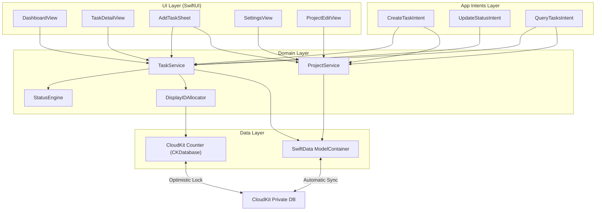

# Design: Transit V1

## Overview

Transit V1 is a native SwiftUI app targeting iOS 26, iPadOS 26, and macOS 26 as a single multiplatform target. It uses SwiftData for model persistence with automatic CloudKit sync, direct CloudKit API for the display ID counter (optimistic locking), and the App Intents framework for CLI integration.

This document focuses on code architecture — how modules connect, data flows, and key interfaces. Visual design decisions are in `docs/transit-design-doc.md` and are not repeated here.

---

## Architecture

### High-Level Data Flow



### Layer Responsibilities

**UI Layer** — SwiftUI views. Uses `@Query` for reactive data from SwiftData. Holds ephemeral state (filter selections, sheet presentation) as `@State`. Delegates mutations to the domain layer.

**Domain Layer** — Business logic. `TaskService` and `ProjectService` encapsulate all create/update operations, enforcing status side effects and validation. `StatusEngine` centralises status transition rules. `DisplayIDAllocator` manages the CloudKit counter. Services are `@MainActor @Observable` classes injected into the SwiftUI environment (main actor isolation ensures safe ModelContext access from both views and App Intents).

**Data Layer** — SwiftData `ModelContainer` configured with CloudKit sync. Direct `CKDatabase` operations for the counter record only.

**App Intents Layer** — Thin wrappers that parse JSON input, call domain services, and format JSON output. No business logic lives here.

### Project Structure

```
Transit/
├── TransitApp.swift                    # @main, ModelContainer setup, environment injection
├── Models/
│   ├── Project.swift                   # @Model, CloudKit-synced
│   ├── TransitTask.swift               # @Model, CloudKit-synced
│   ├── TaskStatus.swift                # Enum with column mapping
│   └── TaskType.swift                  # Enum
├── Services/
│   ├── TaskService.swift               # Task CRUD, status transitions
│   ├── ProjectService.swift            # Project CRUD, active task counts
│   ├── StatusEngine.swift              # Status transition side effects
│   └── DisplayIDAllocator.swift        # CloudKit counter with optimistic locking
├── Views/
│   ├── Dashboard/
│   │   ├── DashboardView.swift         # Root view, layout switching
│   │   ├── KanbanBoardView.swift       # Multi-column board (iPad/Mac/landscape)
│   │   ├── SingleColumnView.swift      # Segmented control layout (iPhone portrait/narrow)
│   │   ├── ColumnView.swift            # Single kanban column with header
│   │   ├── TaskCardView.swift          # Glass card with project border
│   │   └── FilterPopoverView.swift     # Project filter popover
│   ├── TaskDetail/
│   │   ├── TaskDetailView.swift        # Read-only detail presentation
│   │   └── TaskEditView.swift          # Edit mode with status picker, metadata editor
│   ├── AddTask/
│   │   └── AddTaskSheet.swift          # Task creation sheet
│   ├── Settings/
│   │   ├── SettingsView.swift          # Grouped list with Projects + General sections
│   │   └── ProjectEditView.swift       # Project create/edit form
│   └── Shared/
│       ├── ProjectColorDot.swift       # Reusable color indicator
│       ├── TypeBadge.swift             # Tinted type badge
│       ├── EmptyStateView.swift        # Empty state messaging
│       └── MetadataSection.swift       # Key-value display/edit
├── Intents/
│   ├── CreateTaskIntent.swift
│   ├── UpdateStatusIntent.swift
│   ├── QueryTasksIntent.swift
│   └── IntentError.swift               # Shared error codes and JSON formatting
└── Extensions/
    ├── Color+Codable.swift             # Color serialisation for SwiftData/CloudKit
    └── Date+TransitHelpers.swift       # 48-hour window computation
```

---

## Components and Interfaces

### StatusEngine

Centralises all status transition logic so that the same rules apply whether a status change comes from drag-and-drop, the detail view status picker, or an App Intent.

```swift
struct StatusEngine {
    /// Set initial state for a newly created task. Separate from applyTransition
    /// because creation is not a "transition from old status" — there is no old status.
    static func initializeNewTask(_ task: TransitTask, now: Date = .now) {
        task.status = .idea
        task.creationDate = now
        task.lastStatusChangeDate = now
    }

    /// Apply side effects for a status transition.
    /// Handles: lastStatusChangeDate, completionDate set/clear.
    static func applyTransition(
        task: TransitTask,
        to newStatus: TaskStatus,
        now: Date = .now
    ) {
        let oldStatus = task.status
        task.status = newStatus
        task.lastStatusChangeDate = now

        switch newStatus {
        case .done, .abandoned:
            task.completionDate = now
        default:
            // Clear completionDate when moving out of terminal status [req 4.8]
            if oldStatus.isTerminal {
                task.completionDate = nil
            }
        }
    }
}
```

Requirements covered: [4.2], [4.3], [4.4], [4.8], [11.9]

### TaskStatus Enum

```swift
enum TaskStatus: String, Codable, CaseIterable {
    case idea
    case planning
    case spec
    case readyForImplementation = "ready-for-implementation"
    case inProgress = "in-progress"
    case readyForReview = "ready-for-review"
    case done
    case abandoned

    /// The visual column this status maps to on the dashboard.
    var column: DashboardColumn {
        switch self {
        case .idea: return .idea
        case .planning: return .planning
        case .spec, .readyForImplementation: return .spec
        case .inProgress, .readyForReview: return .inProgress
        case .done, .abandoned: return .doneAbandoned
        }
    }

    /// Whether this is an agent handoff status that renders promoted in its column.
    var isHandoff: Bool {
        self == .readyForImplementation || self == .readyForReview
    }

    var isTerminal: Bool {
        self == .done || self == .abandoned
    }

    /// Short labels for iPhone segmented control [req 13.2]
    var shortLabel: String {
        switch column {
        case .idea: return "Idea"
        case .planning: return "Plan"
        case .spec: return "Spec"
        case .inProgress: return "Active"
        case .doneAbandoned: return "Done"
        }
    }
}

enum DashboardColumn: String, CaseIterable, Identifiable {
    case idea, planning, spec, inProgress, doneAbandoned

    var id: String { rawValue }

    var displayName: String {
        switch self {
        case .idea: return "Idea"
        case .planning: return "Planning"
        case .spec: return "Spec"
        case .inProgress: return "In Progress"
        case .doneAbandoned: return "Done / Abandoned"
        }
    }

    /// The status assigned when a task is dropped into this column.
    /// Columns that contain multiple statuses map to the "base" status —
    /// handoff statuses (readyForImplementation, readyForReview) are only
    /// set via the detail view status picker or App Intents, not via drag.
    var primaryStatus: TaskStatus {
        switch self {
        case .idea: return .idea
        case .planning: return .planning
        case .spec: return .spec                // not .readyForImplementation
        case .inProgress: return .inProgress    // not .readyForReview
        case .doneAbandoned: return .done       // never .abandoned via drag [req 7.4]
        }
    }
}
```

Requirements covered: [4.1], [5.2], [5.3], [5.4], [13.2]

### DisplayIDAllocator

Manages the CloudKit counter record for sequential display ID allocation with optimistic locking and offline provisioning.

```swift
@Observable
final class DisplayIDAllocator {
    private let container: CKContainer
    private let database: CKDatabase

    private static let counterRecordType = "DisplayIDCounter"
    /// Counter lives in SwiftData's zone for subscription simplicity.
    private static let zoneID = CKRecordZone.ID(
        zoneName: "com.apple.coredata.cloudkit.zone",
        ownerName: CKCurrentUserDefaultName
    )
    private static let counterRecordID = CKRecord.ID(recordName: "global-counter", zoneID: zoneID)
    private static let counterField = "nextDisplayId"

    /// Allocate the next display ID. Retries on conflict. [req 3.1, 3.8]
    func allocateNextID() async throws -> Int {
        // Fetch current counter → increment → save with .ifServerRecordUnchanged
        // On CKError.serverRecordChanged, retry with server's version
        // Returns the allocated integer
    }

    /// Returns a provisional marker for offline-created tasks. [req 3.4]
    func provisionalID() -> DisplayID {
        .provisional
    }

    /// Promote all provisional tasks to permanent IDs.
    /// Sorts by creationDate so display IDs reflect creation order. [req 3.5]
    /// Saves after each individual promotion — if one fails, previously
    /// promoted tasks keep their IDs and the failed task retries next time.
    func promoteProvisionalTasks(in context: ModelContext) async {
        let predicate = #Predicate<TransitTask> { $0.permanentDisplayId == nil }
        let descriptor = FetchDescriptor(predicate: predicate, sortBy: [SortDescriptor(\.creationDate)])
        guard let provisionalTasks = try? context.fetch(descriptor) else { return }
        for task in provisionalTasks {
            do {
                let id = try await allocateNextID()
                task.permanentDisplayId = id
                try context.save()
            } catch {
                // Stop promoting — remaining tasks will retry on next trigger.
                // Counter may have been incremented for a failed save, producing
                // a gap in display IDs. This is acceptable per [req 3.3].
                break
            }
        }
    }
}

/// Represents either a permanent or provisional display ID.
enum DisplayID: Codable, Equatable {
    case permanent(Int)
    case provisional

    /// Formatted string for UI display. [req 3.6, 3.7]
    var formatted: String {
        switch self {
        case .permanent(let id): return "T-\(id)"
        case .provisional: return "T-•"
        }
    }
}
```

Requirements covered: [3.1], [3.2], [3.4], [3.5], [3.6], [3.7], [3.8]

### TaskService

Central service for all task mutations. Injected into the environment and used by both views and App Intents.

```swift
@MainActor @Observable
final class TaskService {
    private let modelContext: ModelContext
    private let displayIDAllocator: DisplayIDAllocator

    /// Create a new task in Idea status. [req 4.7, 10.6]
    func createTask(
        name: String,
        description: String?,
        type: TaskType,
        project: Project,
        metadata: [String: String]?
    ) async throws -> TransitTask {
        let displayID: DisplayID
        do {
            let id = try await displayIDAllocator.allocateNextID()
            displayID = .permanent(id)
        } catch {
            // Offline — use provisional [req 3.4]
            displayID = .provisional
        }

        let task = TransitTask(
            name: name,
            description: description,
            type: type,
            project: project,
            displayID: displayID,
            metadata: metadata
        )
        StatusEngine.initializeNewTask(task)
        modelContext.insert(task)
        try modelContext.save()
        return task
    }

    /// Change task status via any source (drag, detail picker, intent). [req 4.2-4.8]
    func updateStatus(task: TransitTask, to newStatus: TaskStatus) throws {
        StatusEngine.applyTransition(task: task, to: newStatus)
        try modelContext.save()
    }

    /// Abandon a task from any status. [req 4.5]
    func abandon(task: TransitTask) throws {
        StatusEngine.applyTransition(task: task, to: .abandoned)
        try modelContext.save()
    }

    /// Restore an abandoned task to Idea. [req 4.6]
    func restore(task: TransitTask) throws {
        StatusEngine.applyTransition(task: task, to: .idea)
        try modelContext.save()
    }

    /// Find task by displayId for intent lookups. [req 17.2]
    func findByDisplayID(_ displayId: Int) throws -> TransitTask? {
        let predicate = #Predicate<TransitTask> { $0.permanentDisplayId == displayId }
        let descriptor = FetchDescriptor(predicate: predicate)
        return try modelContext.fetch(descriptor).first
    }
}
```

Requirements covered: [2.4], [3.4], [4.2]–[4.8], [10.6], [17.2]

### ProjectService

```swift
@MainActor @Observable
final class ProjectService {
    private let modelContext: ModelContext

    /// Create a new project. [req 1.4]
    func createProject(
        name: String,
        description: String,
        gitRepo: String?,
        color: Color
    ) throws -> Project {
        let project = Project(name: name, description: description, gitRepo: gitRepo, color: color)
        modelContext.insert(project)
        try modelContext.save()
        return project
    }

    /// Find project by UUID or name for intent lookups. [req 16.3, 16.4]
    /// Name matching is case-insensitive with leading/trailing whitespace trimmed.
    /// If multiple projects match the name, returns AMBIGUOUS_PROJECT.
    func findProject(id: UUID?, name: String?) throws -> Result<Project, IntentError> {
        if let id {
            // UUID lookup — exact match
            let predicate = #Predicate<Project> { $0.id == id }
            let descriptor = FetchDescriptor(predicate: predicate)
            guard let project = try modelContext.fetch(descriptor).first else {
                return .failure(.projectNotFound(hint: "No project with id \(id)"))
            }
            return .success(project)
        } else if let name {
            let trimmed = name.trimmingCharacters(in: .whitespaces)
            // Fetch all projects and filter in-memory for case-insensitive match
            let all = try modelContext.fetch(FetchDescriptor<Project>())
            let matches = all.filter { $0.name.localizedCaseInsensitiveCompare(trimmed) == .orderedSame }
            switch matches.count {
            case 0: return .failure(.projectNotFound(hint: "No project named '\(trimmed)'"))
            case 1: return .success(matches[0])
            default: return .failure(.ambiguousProject(
                hint: "\(matches.count) projects match '\(trimmed)'. Use projectId instead."
            ))
            }
        }
        return .failure(.invalidInput(hint: "Provide either projectId or project name"))
    }

    /// Count of non-terminal tasks for a project. [req 12.3]
    func activeTaskCount(for project: Project) -> Int {
        (project.tasks ?? []).filter { !$0.status.isTerminal }.count
    }
}
```

Requirements covered: [1.4], [1.5], [12.3], [16.3], [16.4], [16.7]

### DashboardView — Layout Switching

The dashboard adapts its layout based on available width. This is the structural decision point for the entire UI.

```swift
struct DashboardView: View {
    @Query(sort: \TransitTask.lastStatusChangeDate, order: .reverse) private var allTasks: [TransitTask]
    @Query private var projects: [Project]
    @State private var selectedProjectIDs: Set<UUID> = []  // Ephemeral filter [req 9.6]
    @State private var selectedColumn: DashboardColumn = .inProgress  // Default: Active [req 13.3]
    @State private var selectedTask: TransitTask?
    @State private var showAddTask = false
    @State private var showFilter = false
    @Environment(\.horizontalSizeClass) private var sizeClass
    @Environment(\.verticalSizeClass) private var verticalSizeClass

    /// Minimum width (in points) for a single kanban column.
    private static let columnMinWidth: CGFloat = 200

    /// Whether the device is in iPhone landscape (compact vertical, any horizontal).
    private var isPhoneLandscape: Bool {
        verticalSizeClass == .compact
    }

    var body: some View {
        GeometryReader { geometry in
            let rawColumnCount = max(1, Int(geometry.size.width / Self.columnMinWidth))
            // iPhone landscape caps at 3 columns with horizontal scroll [req 13.4]
            let columnCount = isPhoneLandscape ? min(rawColumnCount, 3) : rawColumnCount

            if columnCount == 1 {
                // Segmented control layout [req 13.1, 13.7]
                SingleColumnView(
                    columns: filteredColumns,
                    selectedColumn: $selectedColumn,  // [req 13.3]
                    ...
                )
            } else {
                // Multi-column kanban [req 5.2, 13.6]
                // iPhone landscape defaults to Planning/Spec/InProgress visible [req 13.5]
                KanbanBoardView(
                    columns: filteredColumns,
                    visibleCount: min(columnCount, 5),
                    initialScrollTarget: isPhoneLandscape ? .planning : nil,  // [req 13.5]
                    ...
                )
            }
        }
        .overlay {
            // Global empty state when no tasks exist across all columns [req 20.1]
            if allTasks.isEmpty {
                EmptyStateView(message: "No tasks yet. Tap + to create one.")
            }
        }
        .navigationTitle("Transit")
        .toolbar { toolbarContent }
    }

    /// Tasks grouped by column, filtered by project selection, with sorting applied.
    private var filteredColumns: [DashboardColumn: [TransitTask]] {
        // Filter by selected projects. project is optional — exclude orphaned tasks.
        let filtered: [TransitTask]
        if selectedProjectIDs.isEmpty {
            filtered = allTasks.filter { $0.project != nil }
        } else {
            filtered = allTasks.filter { task in
                guard let projectId = task.project?.id else { return false }
                return selectedProjectIDs.contains(projectId)
            }
        }

        let now = Date.now
        let cutoff = now.addingTimeInterval(-48 * 60 * 60)

        return Dictionary(grouping: filtered) { $0.status.column }
            .mapValues { tasks in
                // For Done/Abandoned column: only tasks within 48 hours [req 5.6]
                // Defensive: terminal tasks without completionDate are treated as just-completed
                // to prevent silent data loss — they show up rather than being hidden.
                tasks.filter { task in
                    if task.status.isTerminal {
                        return (task.completionDate ?? now) > cutoff
                    }
                    return true
                }
                // In Done/Abandoned column: done tasks first, then abandoned [req 5.5]
                // Within each group: handoff tasks first [req 5.3, 5.4], then by date [req 5.8]
                .sorted { a, b in
                    // Separate done from abandoned within the terminal column
                    if a.status == .abandoned != (b.status == .abandoned) {
                        return b.status == .abandoned  // done sorts before abandoned
                    }
                    if a.status.isHandoff != b.status.isHandoff {
                        return a.status.isHandoff
                    }
                    return a.lastStatusChangeDate > b.lastStatusChangeDate
                }
            }
    }
}
```

Requirements covered: [5.1]–[5.9], [9.2]–[9.6], [13.1], [13.3]–[13.7], [20.1]

### Drag and Drop

Task cards conform to `Transferable` using their UUID. Drop targets on each column resolve the UUID back to a task and apply the status change.

```swift
// On TaskCardView
.draggable(task.id.uuidString)  // [req 7.1]

// On ColumnView
.dropDestination(for: String.self) { uuids, _ in
    guard let uuidString = uuids.first,
          let uuid = UUID(uuidString: uuidString),
          let task = findTask(by: uuid) else { return false }

    let targetStatus = column.primaryStatus
    // Drag to Done/Abandoned column always means Done [req 7.2, 7.4]
    if column == .doneAbandoned {
        try? taskService.updateStatus(task: task, to: .done)
    } else {
        try? taskService.updateStatus(task: task, to: targetStatus)
    }
    return true
}
```

Each `DashboardColumn` has a `primaryStatus` — the status assigned when a task is dropped into that column. For `.doneAbandoned` this is `.done` (never `.abandoned` via drag, per [req 7.4]).

Requirements covered: [7.1]–[7.5]

### ColumnView — Done/Abandoned Column Structure

The Done/Abandoned column renders done tasks first, then a visual separator, then abandoned tasks (sorting is handled in `filteredColumns`). `ColumnView` detects the boundary between done and abandoned tasks and inserts a `Divider` with a "Abandoned" label. [req 5.5]

**Abandoned task styling** is applied conditionally in `TaskCardView`: [req 5.7]
```swift
.opacity(task.status == .abandoned ? 0.5 : 1.0)
// Task name uses .strikethrough() when abandoned
```

**Per-column empty state**: When a column has zero tasks, it shows a contextual message (e.g., "No tasks in Planning"). [req 20.2]

**Settings projects empty state**: When no projects exist, the Projects section shows a prompt: "Create your first project to get started." [req 20.4]

Requirements covered: [5.5], [5.7], [20.2], [20.4]

### App Intents — JSON Wrapper Pattern

All intents accept a single `String` parameter containing JSON, parse it internally, call domain services, and return JSON.

```swift
struct CreateTaskIntent: AppIntent {
    static var title: LocalizedStringResource = "Transit: Create Task"
    static var openAppWhenRun: Bool = true  // Ensures in-process execution with ModelContext

    @Parameter(title: "Input")
    var input: String

    @Dependency
    private var taskService: TaskService

    @Dependency
    private var projectService: ProjectService

    @MainActor
    func perform() async throws -> some ReturnsValue<String> {
        // 1. Parse JSON input
        guard let data = input.data(using: .utf8),
              let json = try? JSONSerialization.jsonObject(with: data) as? [String: Any] else {
            return .result(value: IntentError.invalidInput(hint: "Expected valid JSON object").json)
        }

        // 2. Resolve project [req 16.3, 16.4]
        let projectResult = try projectService.findProject(
            id: (json["projectId"] as? String).flatMap(UUID.init),
            name: json["project"] as? String
        )
        guard case .success(let project) = projectResult else {
            // Return PROJECT_NOT_FOUND or AMBIGUOUS_PROJECT
        }

        // 3. Validate required fields [req 16.6]
        guard let name = json["name"] as? String else {
            return .result(value: IntentError.invalidInput(hint: "Missing required field: name").json)
        }

        // 4. Validate type [req 16.8]
        guard let typeString = json["type"] as? String,
              let type = TaskType(rawValue: typeString) else {
            return .result(value: IntentError.invalidType(hint: "...").json)
        }

        // 5. Create task [req 16.5]
        let task = try await taskService.createTask(
            name: name,
            description: json["description"] as? String,
            type: type,
            project: project,
            metadata: json["metadata"] as? [String: String]
        )

        // 6. Return JSON response
        return .result(value: """
            {"taskId":"\(task.id)","displayId":\(task.permanentDisplayId ?? -1),"status":"idea"}
            """)
    }
}
```

Requirements covered: [16.1]–[16.8]

**UpdateStatusIntent** and **QueryTasksIntent** follow the same pattern: `openAppWhenRun = true`, `@MainActor func perform()`, `@Dependency` for services.

QueryTasksIntent parses optional filters (`status`, `projectId`, `type`) from JSON, fetches matching tasks via SwiftData predicates, and returns a JSON array. Each task object includes: `taskId`, `displayId`, `name`, `status`, `type`, `projectId`, `projectName`, `completionDate`, `lastStatusChangeDate`. [req 18.4]

When a `projectId` filter is provided but doesn't match any project, the intent returns `PROJECT_NOT_FOUND`. [req 18.5] When no filters are provided, all tasks are returned. [req 18.3]

Requirements covered: [17.1]–[17.6], [18.1]–[18.5]

### Navigation and Presentation

```swift
@main
struct TransitApp: App {
    let container: ModelContainer
    let taskService: TaskService
    let projectService: ProjectService
    let displayIDAllocator: DisplayIDAllocator

    init() {
        let schema = Schema([Project.self, TransitTask.self])
        let config = ModelConfiguration(cloudKitDatabase: .private("iCloud.com.example.transit"))
        let container = try! ModelContainer(for: schema, configurations: [config])
        self.container = container

        let context = ModelContext(container)
        let allocator = DisplayIDAllocator(container: CKContainer.default())
        let taskSvc = TaskService(modelContext: context, displayIDAllocator: allocator)
        let projectSvc = ProjectService(modelContext: context)

        self.taskService = taskSvc
        self.projectService = projectSvc
        self.displayIDAllocator = allocator

        // Register for App Intents @Dependency resolution.
        // Without this, intents cannot resolve TaskService or ProjectService.
        AppDependencyManager.shared.add(dependency: taskSvc)
        AppDependencyManager.shared.add(dependency: projectSvc)
    }

    var body: some Scene {
        WindowGroup {
            NavigationStack {
                DashboardView()
                    .navigationDestination(for: NavigationDestination.self) { dest in
                        switch dest {
                        case .settings: SettingsView()
                        case .projectEdit(let project): ProjectEditView(project: project)
                        }
                    }
            }
        }
        .modelContainer(container)
    }
}
```

**Intent execution context**: All intents set `openAppWhenRun = true` to ensure they execute in the app's process with access to the shared `ModelContainer`. This avoids the complexity of App Group containers for out-of-process execution. The trade-off is that the app briefly opens when an intent runs from Shortcuts or CLI — acceptable for a developer-facing tool, and already a requirement for the future MCP integration.

**`@MainActor` on `perform()`**: Required because `TaskService` and `ProjectService` are `@MainActor`. In Swift 6, accessing `@MainActor` properties from a non-isolated context is a compile error. All intent `perform()` methods must be annotated `@MainActor`.

**Sheet presentation** is handled at the DashboardView level:
- `AddTaskSheet` — presented via `.sheet` (bottom sheet on iPhone [req 10.4], modal on iPad/Mac [req 10.5])
- `TaskDetailView` — presented via `.sheet` (bottom sheet on iPhone [req 11.6], modal on iPad/Mac [req 11.7])
- `FilterPopoverView` — presented via `.popover` anchored to the filter button [req 9.1]

**Settings** is pushed onto the `NavigationStack` [req 12.1], not presented as a sheet.

Requirements covered: [5.1], [8.1]–[8.3], [10.4], [10.5], [11.6], [11.7], [12.1], [12.2]

---

## Data Models

### SwiftData Models

```swift
@Model
final class Project {
    var id: UUID
    var name: String
    var projectDescription: String  // "description" is reserved in some contexts
    var gitRepo: String?
    var colorHex: String  // Stored as hex string for CloudKit compatibility

    @Relationship(deleteRule: .nullify, inverse: \TransitTask.project)
    var tasks: [TransitTask]?

    // Computed
    var color: Color { Color(hex: colorHex) }

    init(name: String, description: String, gitRepo: String?, color: Color) {
        self.id = UUID()
        self.name = name
        self.projectDescription = description
        self.gitRepo = gitRepo
        self.colorHex = color.hexString
    }
}

@Model
final class TransitTask {
    var id: UUID
    var permanentDisplayId: Int?  // nil when provisional [req 3.4]
    var name: String
    var taskDescription: String?  // Optional [decision 5]
    var statusRawValue: String    // Stored as raw string for CloudKit
    var typeRawValue: String      // Stored as raw string for CloudKit
    var creationDate: Date        // Set once at creation, never modified. Used for promotion ordering.
    var lastStatusChangeDate: Date
    var completionDate: Date?
    var metadataJSON: String?     // Stored as JSON string for CloudKit compatibility

    var project: Project?

    // Computed properties
    var status: TaskStatus {
        get { TaskStatus(rawValue: statusRawValue) ?? .idea }
        set { statusRawValue = newValue.rawValue }
    }

    var type: TaskType {
        get { TaskType(rawValue: typeRawValue) ?? .feature }
        set { typeRawValue = newValue.rawValue }
    }

    var displayID: DisplayID {
        if let id = permanentDisplayId {
            return .permanent(id)
        }
        return .provisional
    }

    var metadata: [String: String] {
        get {
            guard let data = metadataJSON?.data(using: .utf8),
                  let dict = try? JSONDecoder().decode([String: String].self, from: data) else {
                return [:]
            }
            return dict
        }
        set {
            metadataJSON = try? String(data: JSONEncoder().encode(newValue), encoding: .utf8)
        }
    }
}
```

**CloudKit compatibility notes:**
- All relationships must be optional for CloudKit. `tasks: [TransitTask]?` on Project and `project: Project?` on TransitTask. CloudKit does not guarantee record delivery order — a Task can sync before its parent Project. Code must nil-coalesce when accessing these relationships (e.g., `project?.name ?? "Unknown"`, `tasks ?? []`).
- `#Predicate` cannot traverse optional to-many relationships. Do not write predicates that filter from Project → tasks. Instead, query from the Task side (`$0.project?.id == targetId`) or filter in-memory after fetch.
- CloudKit does not support `.deny` delete rules — `.nullify` is used instead. V1 does not support project deletion [req 1.6], but the service layer must enforce this since the data model cannot.
- The "every task belongs to a project" invariant is enforced in `TaskService.createTask` (which requires a non-nil `Project` parameter), not in the model. A task with `project == nil` is a transient sync state, not a valid application state.
- Enums are stored as raw strings rather than using Swift enum types directly, because CloudKit needs string/number fields.
- Color is stored as a hex string because `Color` is not directly `Codable` for CloudKit.
- Metadata is stored as a JSON string rather than a dictionary because CloudKit doesn't support dictionary fields.
- `@Attribute(.unique)` is not used because CloudKit does not support unique constraints. SwiftData + CloudKit relies on the `id` property's UUID for record identity. Deduplication is handled by CloudKit's record-level merge (last-write-wins).

### CloudKit Counter Record

A single `CKRecord` of type `DisplayIDCounter` with record name `global-counter` in the `com.apple.coredata.cloudkit.zone` zone (same zone as SwiftData records, for subscription simplicity):

| Field | Type | Purpose |
|-------|------|---------|
| `nextDisplayId` | Int64 | The next ID to allocate. Starts at 1. |

**Allocation flow:**
1. Fetch the counter record from CloudKit
2. If record exists: read `nextDisplayId` (e.g., 43), save with `nextDisplayId = 44` using `.ifServerRecordUnchanged`
3. If record does not exist (first-ever allocation): create a new `CKRecord` with `nextDisplayId = 2` and save using `.allKeys` save policy. If `CKError.serverRecordChanged` occurs (another device created it first), fetch the server's record and continue as normal.
4. If save succeeds → return the allocated ID (43 in step 2, or 1 in step 3)
5. If `CKError.serverRecordChanged` → fetch the server's latest record and retry from step 2
6. If offline → return `.provisional` and queue allocation for when connectivity resumes

**Counter record schema**: The `DisplayIDCounter` record type must exist in the CloudKit schema. During development, it is auto-created when the first record is written to the development environment. For production, it must be promoted to the production schema via the CloudKit Dashboard before the app ships.

**Promotion triggers**: `promoteProvisionalTasks` runs:
- On app launch (in `.task` modifier on the root view)
- On `scenePhase` change to `.active` (app foreground)
- On `NWPathMonitor` reporting a transition from unsatisfied to satisfied (connectivity restored)

**Cross-device ordering**: Display IDs reflect sync/allocation order, not wall-clock creation order. Two devices creating tasks offline will produce IDs based on whichever syncs first. This is expected and acceptable — display IDs are unique but not strictly chronological.

Requirements covered: [1.1], [1.2], [2.1], [2.2], [2.3], [2.5], [2.6], [3.1]–[3.8]

---

## Error Handling

### Intent Errors

```swift
enum IntentError {
    case taskNotFound(hint: String)
    case projectNotFound(hint: String)
    case ambiguousProject(hint: String)
    case invalidStatus(hint: String)
    case invalidType(hint: String)
    case invalidInput(hint: String)

    var code: String {
        switch self {
        case .taskNotFound: return "TASK_NOT_FOUND"
        case .projectNotFound: return "PROJECT_NOT_FOUND"
        case .ambiguousProject: return "AMBIGUOUS_PROJECT"
        case .invalidStatus: return "INVALID_STATUS"
        case .invalidType: return "INVALID_TYPE"
        case .invalidInput: return "INVALID_INPUT"
        }
    }

    /// JSON-encoded error response. Uses JSONSerialization to safely escape
    /// special characters in the hint string. [req 19.1]
    var json: String {
        let dict: [String: String] = ["error": code, "hint": hint]
        guard let data = try? JSONSerialization.data(withJSONObject: dict),
              let str = String(data: data, encoding: .utf8) else {
            return "{\"error\":\"\(code)\",\"hint\":\"Internal encoding error\"}"
        }
        return str
    }
}
```

Requirements covered: [19.1], [19.2], [19.3]

### Display ID Allocation Errors

- **Network available, optimistic lock conflict** → Retry (up to 5 attempts with exponential backoff). If all retries fail, fall back to provisional.
- **Network unavailable** → Return provisional immediately. Queue allocation for sync.
- **Counter record doesn't exist** → Create it with `nextDisplayId = 2` (allocating ID 1) using `.allKeys` save policy. If two devices race to create, one gets `CKError.serverRecordChanged` — it fetches the server's record and retries via the normal conflict path.

### CloudKit Sync Toggle

Toggling CloudKit sync at runtime is non-trivial — you cannot reconfigure a live `ModelContainer`. V1 uses a pragmatic approach:

- The `ModelContainer` is always created with `cloudKitDatabase: .private(...)`.
- The sync toggle in Settings controls a `UserDefaults` flag (`syncEnabled`).
- When `syncEnabled == false`: the app sets the `NSPersistentCloudKitContainer`'s underlying `NSPersistentStoreDescription.cloudKitContainerOptions = nil` to pause sync. Local reads and writes continue normally.
- When `syncEnabled` transitions from `false` to `true`: restore `cloudKitContainerOptions`, then call `container.initializeCloudKitSchema(options: [])` followed by a manual export of pending changes. SwiftData's persistent history tracking handles the delta sync — changes made while sync was off are pushed on re-enable. [req 12.9]

**Fallback**: If the above approach proves unreliable during implementation, an acceptable alternative is recreating the `ModelContainer` with a new configuration. This requires dismissing all views, creating a new container, and re-injecting it into the environment. More disruptive but simpler to reason about.

### CloudKit Sync Errors

- **Quota exceeded / account issues** → Surface via SwiftData's error handling. Not custom-handled in V1.
- **Provisional tasks with sync disabled** → If the user disables sync while provisional tasks exist, those tasks keep their "T-•" IDs until sync is re-enabled. On re-enable, `promoteProvisionalTasks` runs as part of the sync restoration flow.

### UI Validation Errors

- **Add Task with empty name** → Create button disabled until name is non-empty. [req 10.6]
- **Add Task with no projects** → Show informational alert directing to Settings. [req 10.7, 20.3]
- **Project creation with empty required fields** → Save button disabled until name, description, and color are provided. [req 1.3]

---

## Testing Strategy

### Unit Tests

**StatusEngine** — The most critical unit to test. Every status transition rule from the requirements has a corresponding test.

| Test | Requirements |
|------|-------------|
| Transition to Done sets completionDate | [4.3] |
| Transition to Abandoned sets completionDate | [4.4] |
| Every transition updates lastStatusChangeDate | [4.2] |
| Moving from Done to non-terminal clears completionDate | [4.8] |
| Moving from Abandoned to non-terminal clears completionDate | [4.8] |
| Moving from Abandoned to Idea (restore) clears completionDate | [4.6] |
| Transition between non-terminal statuses does not set completionDate | [4.2] |
| Re-abandoning a Done task overwrites completionDate | [4.5] |

**Property-based testing candidate**: StatusEngine transitions are a strong PBT candidate. Properties to verify:
- For any sequence of status transitions, `completionDate` is non-nil if and only if the current status is terminal
- `lastStatusChangeDate` is always >= the initial creation date
- `lastStatusChangeDate` is monotonically non-decreasing across transitions applied in sequence

Use Swift's `swift-testing` framework. For PBT, use a custom generator that produces random sequences of `TaskStatus` values and applies them in order, checking invariants after each transition.

**TaskStatus.column mapping** — Every status maps to exactly one column. Handoff statuses map to their parent column.

| Test | Requirements |
|------|-------------|
| readyForImplementation maps to spec column | [5.3] |
| readyForReview maps to inProgress column | [5.4] |
| done and abandoned both map to doneAbandoned column | [5.2] |

**DisplayID formatting**

| Test | Requirements |
|------|-------------|
| Permanent ID formats as "T-{number}" | [3.6] |
| Provisional ID formats as "T-•" | [3.7] |

**Intent JSON parsing** — Test the full parse → validate → execute → format cycle for each intent.

| Test | Requirements |
|------|-------------|
| CreateTask with valid JSON returns success | [16.5] |
| CreateTask with missing name returns INVALID_INPUT | [16.6] |
| CreateTask with invalid type returns INVALID_TYPE | [16.8] |
| CreateTask with ambiguous project name returns AMBIGUOUS_PROJECT | [16.4] |
| CreateTask prefers projectId over project name | [16.3] |
| UpdateStatus with valid input returns previous and new status | [17.4] |
| UpdateStatus with unknown displayId returns TASK_NOT_FOUND | [17.5] |
| UpdateStatus with invalid status string returns INVALID_STATUS | [17.6] |
| QueryTasks with no filters returns all tasks | [18.3] |
| QueryTasks with status filter returns matching tasks | [18.2] |
| All error responses match the JSON structure | [19.1] |

**Dashboard column filtering**

| Test | Requirements |
|------|-------------|
| Done/Abandoned column excludes tasks older than 48 hours | [5.6] |
| Terminal task with nil completionDate shows (defensive, not hidden) | [5.6] |
| Handoff tasks sort before regular tasks in their column | [5.3], [5.4], [5.8] |
| Done tasks sort before abandoned in Done/Abandoned column | [5.5] |
| Project filter reduces tasks to selected projects only | [9.2] |
| Column counts include handoff tasks | [5.9] |
| Empty filter (no projects selected) shows all tasks | [9.5] |
| Tasks with nil project are excluded from filtered results | CloudKit safety |

**Drag-and-drop status mapping**

| Test | Requirements |
|------|-------------|
| Dropping on Idea column sets status to Idea | [7.1] |
| Dropping on Planning column sets status to Planning | [7.1] |
| Dropping on Spec column sets status to Spec (not readyForImplementation) | [7.1] |
| Dropping on In Progress column sets status to In Progress (not readyForReview) | [7.1] |
| Dropping on Done/Abandoned column sets status to Done | [7.2] |
| Dropping on Done/Abandoned column never sets Abandoned | [7.4] |
| Backward drag (In Progress to Planning) works | [7.1] |
| Dropping a Done task on a non-terminal column clears completionDate | [7.5] |

**Display ID allocation and promotion**

| Test | Requirements |
|------|-------------|
| Creating a task offline returns provisional display ID | [3.4] |
| promoteProvisionalTasks assigns IDs in creationDate order | [3.5] |
| Partial promotion failure: promoted tasks keep IDs, remaining stay provisional | [3.5] |
| Counter conflict triggers retry and eventually succeeds | [3.8] |

**Constraint enforcement**

| Test | Requirements |
|------|-------------|
| ProjectService has no delete method (no project deletion) | [1.6] |
| TaskService has no delete method (no task deletion) | [2.7] |
| Task can be moved between projects via updateProject | [2.4] |

### UI Tests

UI tests focus on navigation flows and presentation, not business logic (which is covered by unit tests).

| Test | Requirements |
|------|-------------|
| Tapping a task card opens detail sheet | [6.4] |
| Tapping + opens add task sheet | [10.1] |
| Tapping + with no projects shows alert | [10.7], [20.3] |
| Tapping gear pushes settings view | [12.1] |
| Settings has back chevron (no label text) | [12.2] |
| Tapping filter button shows popover | [9.1] |
| Filter count badge updates when projects selected | [9.3] |
| Empty column shows empty state message | [20.2] |
| Dashboard with zero tasks shows global empty state | [20.1] |
| Settings with zero projects shows create prompt | [20.4] |
| iPhone portrait defaults to Active segment | [13.3] |
| Abandoned task card shows reduced opacity | [5.7] |

### Integration Tests

| Test | Requirements |
|------|-------------|
| Task created via intent appears in dashboard | [16.1] |
| Status updated via intent reflects in dashboard | [17.1] |
| Query intent returns tasks matching filters | [18.1] |
| Display ID counter increments correctly across multiple creates | [3.1], [3.2] |

---

## Requirements Traceability

Every requirement section maps to design components:

| Req Section | Design Components |
|---|---|
| 1. Project Data Model | `Project` model, `ProjectService` |
| 2. Task Data Model | `TransitTask` model, `TaskService` |
| 3. Display ID Allocation | `DisplayIDAllocator`, `DisplayID` enum |
| 4. Status Progression | `StatusEngine`, `TaskStatus` enum |
| 5. Dashboard Kanban | `DashboardView`, `KanbanBoardView`, `ColumnView` |
| 6. Task Cards | `TaskCardView` |
| 7. Drag and Drop | `TaskCardView` (draggable), `ColumnView` (drop target) |
| 8. Navigation Bar | `DashboardView` toolbar |
| 9. Project Filter | `FilterPopoverView`, `DashboardView` filter state |
| 10. Add Task | `AddTaskSheet`, `TaskService.createTask` |
| 11. Detail View | `TaskDetailView`, `TaskEditView` |
| 12. Settings | `SettingsView`, `ProjectEditView` |
| 13. Adaptive Layout | `DashboardView` (GeometryReader + column count), `SingleColumnView` |
| 14. Liquid Glass | `.glassEffect()` applied in `TaskCardView`, `ColumnView`, navigation |
| 15. CloudKit Sync | `ModelContainer` CloudKit config, `DisplayIDAllocator` |
| 16. Create Task Intent | `CreateTaskIntent` |
| 17. Update Status Intent | `UpdateStatusIntent` |
| 18. Query Tasks Intent | `QueryTasksIntent` |
| 19. Intent Error Handling | `IntentError` enum |
| 20. Empty States | `EmptyStateView`, conditional rendering in views |
